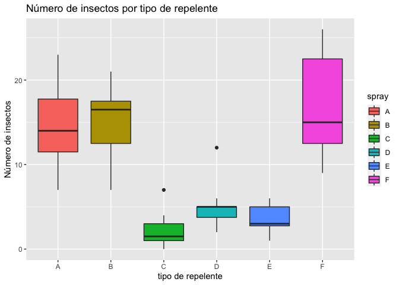
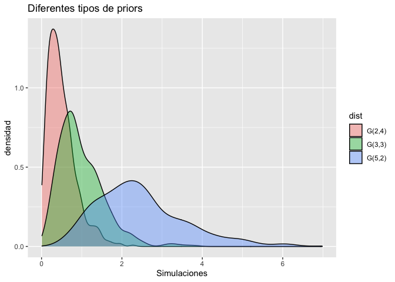
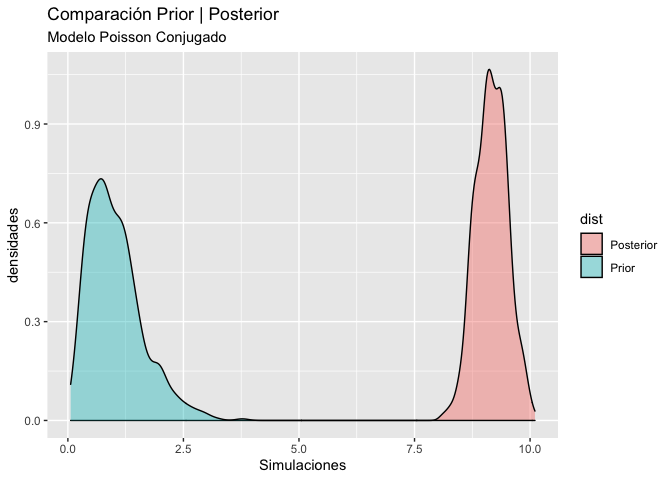
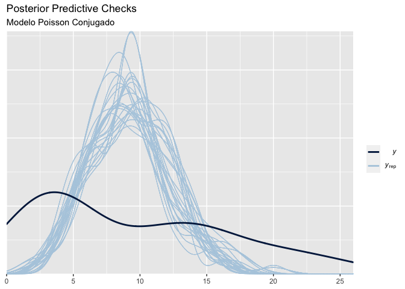
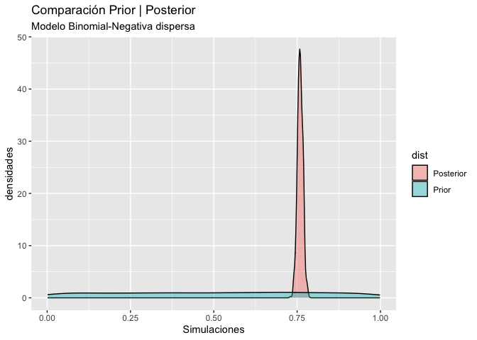
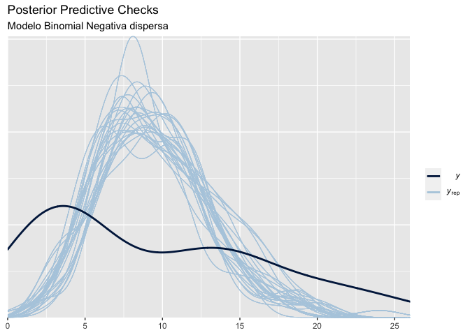
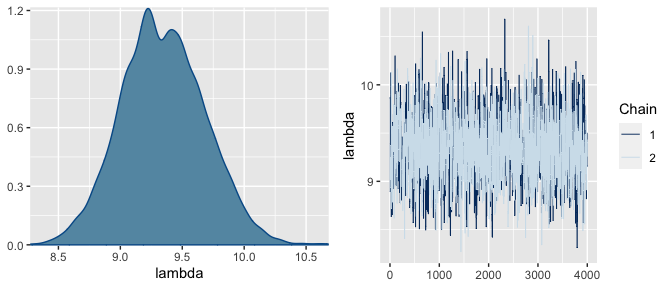
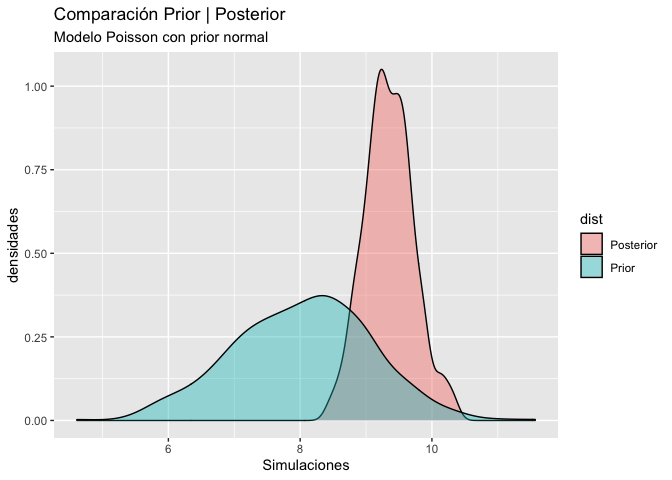
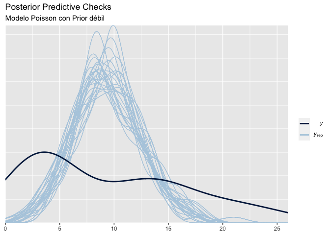
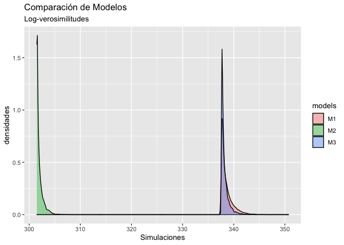

Efectividad de repelentes para insectos
================
Asael Alonzo Matamoros.
2022-12-04

Se desea evaluar la efectividad de seis diferentes tipos de repelentes
para insectos
().

El experimento consiste en contar el número de insectos en cierta área
delimitada, horas después de aplicar cierto tipo de repelente. El
experimento se replicó 72 veces, 12 veces para cada uno de los tipos de
repelente.

``` r
library(GGally)
library(ggplot2)
library(flextable)
library(bayesplot)
library(posterior)

data("InsectSprays")
```

La [Figure 1](#fig-box) resume la distribución y valores medios del
número de insectos encontrados en cada uno de los tipos de repelente
utilizados. Claramente, las distribuciones son no simétricas y muy
heterogéneas entre cada uno de los tipos, y los datos son de tipo
discreto, por lo tanto se descartan los supuestos de normalidad.

Supondremos tres modelos distintos:

- Modelo de Poisson, con parámetro
  
  desconocido y prior conjugada de tipo Gamma:

, \quad \lambda \sim Gamma(\alpha,\beta).")

- Modelo Binomial negativa, con parámetro
   desconocido y prior
  dispersa:

, \quad \lambda \sim U(1,1).")

- Modelo de Poisson, con parámetro
  
  desconocido y prior no conjugada de tipo Normal:

, \quad \lambda \sim N(\mu,\sigma^2).")

Note que en cada modelo, no consideramos la dispersión entre grupos
presente en los datos, simplemente queremos modelar la distribución
global del número de insectos contabilizados independiente del repelente
utilizado.

``` r
ggplot(aes(y = count, x = spray,fill = spray),data = InsectSprays)+
  geom_boxplot()+
  labs(title = "Número de insectos por tipo de repelente",
       x = "tipo de repelente",y = "Número de insectos")
```

<figure>

<figcaption aria-hidden="true">Figure 1: Gráfico de cajas. Cada caja
representa una distribución por cuantiles del número de insectos
encontrados en cada uno de los tipos de repelentes. Los repelentes de
tipo A,B y F, presentan más insectos que las cajas C, D y E. Además, las
dispersiones de los primeros tres tipos son mayores a las dispersiones
presentadas en las cajas C, D y E.</figcaption>
</figure>

Los ejemplos propuestos se resolverán de tres diferentes formas:

1.  Los modelos  y
     se resolverán
    con un Gibbs sampler, que para estos casos es un simple MC.

2.  El modelo  se
    resolverá con un Metrópolis-Hastings.

## Modelo  de Poisson Conjugado

Se define el número de insectos encontrado como una variable aleatoria
discreta de tipo Poisson con parámetro

desconocido
("))
y aleatorio, la priori para
 es
una prior conjugada y “poco informativa”. Asumamos que los repelentes
aplicados son efectivos y elegir una prior Gamma tal que centre la
probabilidad en valores cercanos al cero.

### Selección de la prior

En este caso, la prior a usar es:

.")

[Figure 2](#fig-priors1) presenta posibles candidatos a priors para el
parámetro
.

``` r
x = c(rgamma(600,2,4),rgamma(600,3,3),rgamma( 600,5,2))
y = c(rep("G(2,4)",600),rep("G(3,3)",600),rep("G(5,2)",600))

df = data.frame(sim = x, dist = y)

ggplot(aes(x = sim,fill = dist),data = df)+
  geom_density(alpha = 0.4)+
  labs(title = "Diferentes tipos de priors",
       x = "Simulaciones",y = "densidad")
```

<figure>

<figcaption aria-hidden="true">Figure 2: Gráfico de densidades. Se
comparan tres distribuciones Gamma como posibles candidatos para priors
de lambda, las tres priors tienen medias similares alrededor de 9, pero
la prior G(2,4) es la que provee mayor dispersión, siendo más
sujetiva.</figcaption>
</figure>

La distribución a posteriori para
 es:

.")

Donde,

684 y
.
Por lo tanto la posterior final es:
").

### Estimadores puntuales

El estimador puntual para
 es:

![\hat \lambda = E\[\lambda \| y\] = \frac{687}{75} \approx 9.16.](https://latex.codecogs.com/svg.latex?%5Chat%20%5Clambda%20%3D%20E%5B%5Clambda%20%7C%20y%5D%20%3D%20%5Cfrac%7B687%7D%7B75%7D%20%5Capprox%209.16. "\hat \lambda = E[\lambda | y] = \frac{687}{75} \approx 9.16.")

[Figure 3](#fig-reslt1) muestra la comparación de las densidades prior y
posterior para el modelo Poisson, pese que la prior se eligió con el
propósito de ser no informativa, la posterior es muy especifica y
centrada en su primer momento.

``` r
x = c(rgamma(600,3,3),rgamma(600,687,75))
y = c(rep("Prior",600),rep("Posterior",600))

df = data.frame(sim = x, dist = y)

ggplot(aes(x = sim,fill = dist),data = df)+
  geom_density(alpha = 0.4)+
  labs(title = "Comparación Prior | Posterior",
       subtitle = "Modelo Poisson Conjugado",
       x = "Simulaciones",y = "densidades")
```

<figure>

<figcaption aria-hidden="true">Figure 3: Gráfico de densidades.
Comparamos la distribuciones a Priori | Posteriori para el modelo
Poisson conjugado, pese que la prior esta focalizada cerca de cero, la
posterior se corre a la media de los datos, con muy poca dispersión,
siendo muy especifica.</figcaption>
</figure>

Los intervalos de credibilidad se encuentran mediante `Monte-Carlo`. Los
intervalos de credibilidad al 90% para la posterior son:

``` r
IC = quantile(rgamma(600,687,75),probs = c(0.05,0.95))
IC
```

          5%      95% 
    8.557253 9.736729 

### Posterior predictive checks

En este caso se realizaran comparaciones de la densidad predictiva del
modelo, esta se puede estimar con `Monte-Carlo` mediante el siguiente
procedimiento.

1.  Para
    ;
    hacer

    - 1.1 Simular un valor
      
      de la posterior
      ").

    - 1.2 Simular un valor de la verosimilitud
      ").

2.  Los valores
    
    son una muestra de
    .

[Figure 4](#fig-ppc1) compara las predictivas distribuciones obtenidas,
notamos que la función predictiva esta muy centrada en el valor esperado
de los datos, y provee un ajuste muy pobre.

``` r
bayesplot_theme_set(theme_grey())
# Predictive
yrep = rep(rpois(600,rgamma(600,687,75)),72)
yrep = matrix(yrep,ncol = 72,byrow = TRUE)

y = InsectSprays$count

ppc_dens_overlay(y, yrep[1:200,])+
  labs(title = "Posterior Predictive Checks",
       subtitle = "Modelo Poisson Conjugado")
```

<figure>

<figcaption aria-hidden="true">Figure 4: Gráfico de densidades.
Comparamos la distribuciones a predictiva y muestra para el modelo
Poisson conjugado.</figcaption>
</figure>

## Modelo  de Binomial Negativa con priori dispersa

Se define el número de insectos encontrado como una variable aleatoria
discreta Binomial negativa con parámetro
 desconocido y

repeticiones,
(")).
La prior es conjugada para
 es la distribución
Beta.

.")

Esta prior genera una posterior de tipo Beta, pero si

la distribución es uniforme en el intervalo unitario, que a su vez es
una prior dispersa para
.

La posterior para  es:

.")

Por lo tanto, la posterior final es:
").
Los estimadores puntuales y por intervalos son:

![\hat p = E\[p \| y\] = \frac{2160}{2160+685} \approx 0.759,](https://latex.codecogs.com/svg.latex?%5Chat%20p%20%3D%20E%5Bp%20%7C%20y%5D%20%3D%20%5Cfrac%7B2160%7D%7B2160%2B685%7D%20%5Capprox%200.759%2C "\hat p = E[p | y] = \frac{2160}{2160+685} \approx 0.759,")

y los intervalos de credibilidad al 90% :

``` r
IC = quantile(rbeta(600,2160,685),probs = c(0.05,0.95))
IC
```

           5%       95% 
    0.7459483 0.7728367 

Los dos valores anteriores no brindan información del fenómeno de
estudio, para una mejor interpretador, calculamos el número de insectos
esperado a posterior, esto es, el valor esperado de la función de
probabilidad que modela los datos, calculado con el estimador puntual
obtenido

![E\[y\|p = \hat p\] = \frac{r(1-\hat p)}{\hat p} \approx 10.](https://latex.codecogs.com/svg.latex?E%5By%7Cp%20%3D%20%5Chat%20p%5D%20%3D%20%5Cfrac%7Br%281-%5Chat%20p%29%7D%7B%5Chat%20p%7D%20%5Capprox%2010. "E[y|p = \hat p] = \frac{r(1-\hat p)}{\hat p} \approx 10.")

El número esperado de insectos con el modelo Binomial negativa es de 10
insectos, que es mayor al obtenido por el modelo
 cuyo valor
esperado fue de 9.16 insectos.

``` r
# Código preliminar al gráfico
bayesplot_theme_set(theme_grey())

# Compare distributions
x = c(rbeta(600,1,1),rbeta(600,2160,685))
y = c(rep("Prior",600),rep("Posterior",600))

df = data.frame(sim = x, dist = y)

# posterior predictive checks
yrep = rep(rnbinom(600,size = 30,rbeta(600,2160,685)),72)
yrep = matrix(yrep,ncol = 72,byrow = TRUE)

y = InsectSprays$count
```

``` r
ggplot(aes(x = sim,fill = dist),data = df)+
  geom_density(alpha = 0.4)+
  labs(title = "Comparación Prior | Posterior",
       subtitle = "Modelo Binomial-Negativa dispersa",
       x = "Simulaciones",y = "densidades")

ppc_dens_overlay(y, yrep[1:200,])+
  labs(title = "Posterior Predictive Checks",
       subtitle = "Modelo Binomial Negativa dispersa")
```

<figure>

<figcaption aria-hidden="true">Figure 5: Comparamos la densidades a
Priori | Posteriori y obtenemos una posterior muy especifica pese lo
dispersa que es la prior.”</figcaption>
</figure>

<figure>

<figcaption aria-hidden="true">Figure 6: La densidad predictiva del
modelo muestra el mal ajuste a los datos, el modelo no captura la
dispersion y asimetría de la muestra.”</figcaption>
</figure>

Comparación de la posterior vs prior y análisis del ajuste del modelo
mediante la densidad predictiva, modelo Binomial negativa.

**?@fig-reslt2** muestra la comparación de las densidades prior y
posterior para el modelo Binomial negativa, pese la sobre-dispersión de
la prior, se obtiene una posterior muy informativa y especifica. El
gráfico derecho compara las predictivas obtenidas, notamos que la
función predictiva esta muy centrada en el valor esperado de los datos,
y provee un ajuste muy pobre.

## Modelo  de Poisson con prior débil

Se define el número de insectos encontrado como una variable aleatoria
discreta de tipo Poisson con parámetro

desconocido
("))
y aleatorio, la prior para
 es

.")

En este caso la prior es no conjugada y se debe realizar el
`algoritmo de Metrópolis`, Metropolis et al. (1953). El siguiente código
muestra la implementación del algoritmo para nuestro modelo, la primera
función calcula la densidad propuesta que es simplemente el producto de
le verosimilitud y la prior,
( = f(y|\theta)f(\theta)")).
La segunda función es del algoritmo mismo.

``` r
post = function(y,lambda,mu,sigma){
  prior = dnorm(lambda,mean = mu,sd = sigma)
  like = prod(dpois(x = y,lambda = lambda))
  post = like*prior
  
  return(post)
}

metropolis = function(y, mu, sigma = 1,iter = 5000,inits = rnorm(1, 5,1)){
  lbd = rep(0,iter) 
  lbd[1] = inits
  for (i in 2:iter) {
    temp = rnorm(1,mean = lbd[i-1])
    
    p1 = post(y,lambda = temp,mu = mu,sigma = sigma)
    p2 = post(y,lambda = lbd[i-1],mu = mu,sigma = sigma)
    pa = p1/p2
    
    lbd[i] = lbd[i-1]
    
    if(pa > runif(1))
      lbd[i] = temp
      
  }
  return(lbd)
}
```

Para este ejemplo simulamos dos cadenas independientes de 5,000
iteraciones, donde el valor inicial de cada cadena se simuló de una
normal con media cinco y varianza uno.

``` r
lambda1 = metropolis(y = InsectSprays$count,mu = 8)
lambda2 = metropolis(y = InsectSprays$count,mu = 8)

df1 = data.frame(chain = sort(rep(1:2,4000)),
                lambda = c(lambda1[1001:5000],lambda2[1001:5000]))
pdf = posterior::as_draws(df1)

mcmc_combo(x = df1,pars = "lambda")
```

<figure>

<figcaption aria-hidden="true">Figure 7: Gráfico de las posterior.
Presentamos los traceplot y densidades de la posterior simulada, usando
2 cadenas de 5000 iteraciones y Warm-up: 1000 iteraciones.</figcaption>
</figure>

[Figure 7](#fig-chain) muestra los trace-plots de ambas cadenas que se
entrelazan entre ellas indicando estacionariadad y convergenica, el
grafico de densidades es uni modal y simétrico indicando convergencia.
**?@tbl-post2** muestra las estadísticas resumen de la posterior de
,
dos indicadores importantes muestran convergencia de las cadenas, el
*effective sample size* (ess) que indica el número de muestras
independientes a las que equivalen las muestras obtenidas de la cadenas,
dichos valores deben ser similar al número de iteraciones. El factor de
convergencia
 es
un valor que compara las varianzas de las cadenas, valores aproximados a
1 indican convergencia.

``` r
x = summarise_draws(pdf)
ft = flextable(x[2,])
autofit(ft)
```

**?@tbl-post2** muestra la media a posterior e intervalos de
credibilidad para la posterior de
.
Además, se muestra el error de `Monte-Carlo`, dicho error debe ser
cercano a 0, valores muy grandes indican alta dispersión de las
simulaciones que se interpreta como una mala aproximación del método.

``` r
# Preliminar
bayesplot_theme_set(theme_grey())

x = c(rnorm(600,8,1),pdf$lambda[1001:1600])
y = c(rep("Prior",600),rep("Posterior",600))

df = data.frame(sim = x, dist = y)

# Predictive
yrep = rep(rpois(600,pdf$lambda[1001:1600]),72)
yrep = matrix(yrep,ncol = 72,byrow = TRUE)

y = InsectSprays$count
```

``` r
ggplot(aes(x = sim,fill = dist),data = df)+
  geom_density(alpha = 0.4)+
  labs(title = "Comparación Prior | Posterior",
       subtitle = "Modelo Poisson con prior normal",
       x = "Simulaciones",y = "densidades")

ppc_dens_overlay(y, yrep[1:200,])+
  labs(title = "Posterior Predictive Checks",
       subtitle = "Modelo Poisson con Prior débil")
```

<figure>

<figcaption aria-hidden="true">Figure 8: Comparamos la densidades a
Priori | Posteriori y obtenemos una posterior muy especifica pese lo
dispersa que es la prior.”</figcaption>
</figure>

<figure>

<figcaption aria-hidden="true">Figure 9: La densidad predictiva del
modelo muestra el mal ajuste a los datos, el modelo no captura la
dispersion y asimetría de la muestra.”</figcaption>
</figure>

Comparación de la posterior vs prior y análisis del ajuste del modelo
mediante la densidad predictiva, modelo de Poisson con prior no
conjugada.

**?@fig-reslt3** muestra la comparación de las densidades prior y
posterior para el modelo Poisson, la dinámica entre la prior y posterior
es mas natural, pero la influencia de los datos hace que la prior sea de
leve influencia en la posterior. El gráfico derecho compara las
predictivas obtenidas, notamos que la función predictiva está muy
centrada en el valor esperado de los datos, y provee un ajuste muy
pobre.

### Selección de Modelos

Para seleccionar el mejor modelo de los tres, utilizaremos los cuatro
criterios definidos, Factor de Bayes, log-likelihood elpd, y WAIC.

#### Factores de Bayes

El código para calcular la densidad marginal de cada modelo es:

``` r
Marginal1 = function(y,iter = 10000){
  mar = 1:iter
  
  for (i in 1:iter) {
    mar[i] = sum(dpois(x = y,lambda = rgamma(n = 1,shape = 3,3),log = TRUE))
  }
  return(mean( exp(mar) ))
}
Marginal2 = function(y,iter = 10000){
  mar = 1:iter
  
  for (i in 1:iter) {
    mar[i] = sum(dnbinom(x = y,prob = rbeta(1,1,1),size = 30,log = TRUE))
  }
  return(mean( exp(mar) ))
}
Marginal3 = function(y,iter = 10000){
  mar = 1:iter
  
  for (i in 1:iter) {
    mar[i] = sum(dpois(x = y,lambda = rnorm(n = 1,mean = 8,sd = 1),log = TRUE))
  }
  return(mean( exp(mar) ))
}
```

Las estimaciones de Monte-Carlo, con

iteraciones para cada modelo son:

``` r
m1 = Marginal1(y = InsectSprays$count,iter = 50000)
m2 = Marginal2(y = InsectSprays$count,iter = 50000)
m3 = Marginal1(y = InsectSprays$count,iter = 50000)
```

Los factores de Bayes para comparar los 3 modelos son:

``` r
FB = log(c(m1/m2,m1/m3,m2/m3))
names(FB) =c("log FB12","log FB13","log FB23") 
FB
```

      log FB12   log FB13   log FB23 
    -133.51917  -68.67013   64.84903 

Las estimaciones obtenidas muestran una evidencia rotunda a preferir el
modelo  sobre el
modelo  y una
evidencia fuerte de preferir el modelo
 sobre el modelo
. Finalmente, hay
evidencia rotunda a predecir el modelo
 sobre el modelo
.

Por lo tanto, el modelo selecionado es:
 Binomial
negativa, con prior dispersa.

El mayor problema de los factores de Bayes son:

- Los modelos son inestables

- El modelo es muy sensible a modelos priors no informativas o muy
  dispersas.

#### log-Verosimilitud

Un estimador muy importante para la selección de modelos es la matriz de
log-verosimilitudes, esta se estima por métodos de Monte-Carlo usando
una muestra de la posterior
,
de la siguiente forma

![\log f(y\|\theta) = \[\log f(y_i\|\theta_j)\] \in \mathbb R^{S \times n}](https://latex.codecogs.com/svg.latex?%5Clog%20f%28y%7C%5Ctheta%29%20%3D%20%5B%5Clog%20f%28y_i%7C%5Ctheta_j%29%5D%20%5Cin%20%5Cmathbb%20R%5E%7BS%20%5Ctimes%20n%7D "\log f(y|\theta) = [\log f(y_i|\theta_j)] \in \mathbb R^{S \times n}")

Las siguientes lineas de código generan la matriz de verosimilitudes

``` r
loglik1 = function(y,iter = 10000){
  loglik  = matrix(nrow = iter, ncol = length(y))
  
  for (i in 1:iter)  
    loglik[i, ] = dpois(y,lambda = rgamma(1,687,75),log = TRUE)
  
  return(loglik)
}

loglik2 = function(y,iter = 10000){
  loglik  = matrix(nrow = iter, ncol = length(y))
  
  for (i in 1:iter)  
    loglik[i, ] = dnbinom(y,size = 30,prob = rbeta(1,2160,685),log = TRUE)
  
  return(loglik)
}

loglik3 = function(y,lbd){
  loglik  = matrix(nrow = length(lbd), ncol = length(y))
  
  for (i in 1:length(lbd))  
    loglik[i, ] = dpois(y,lambda = lbd[i],log = TRUE)
  
  return(loglik)
}
```

A partir de las matrices de log-verosimilitudes se puede estimar una
muestra a posteriori de la log-verosimilitud del modelo a partir de la
siguiente ecuación

 = -\sum_{i=1}^n \log f(y_i | \theta).")

Estos valores pueden utilizarse para comparación preliminar de modelos,
pero como una medida absoluta, la siguiente figura muestra las
posteriors de las log verosimilitudes:

``` r
ll1 = loglik1(y = InsectSprays$count,iter = 8000)
ll2 = loglik2(y = InsectSprays$count,iter = 8000)
ll3 = loglik3(y = InsectSprays$count,lbd = df1$lambda)

logVero = data.frame(
      loglik = c(apply(-ll1,1,sum),apply(-ll2,1,sum),apply(-ll3,1,sum)),
      models = c(rep("M1",8000),rep("M2",8000),rep("M3",8000))
    )

ggplot(aes(x = loglik,fill = models),data = logVero)+
  geom_density(alpha = 0.4)+
  labs(title = "Comparación de Modelos",
       subtitle = "Log-verosimilitudes",
       x = "Simulaciones",y = "densidades")
```



Las log-verosimilitudes indican que el modelo
 con
verosimilitud Binomial Negativa estima mucho mejor que los dos modelos
con verosimilitud de Poisson.

#### Expected log-Predictive density (elpd)

La elpd es una medida de divergencia entre el modelo ajustado y la
distribución real de los datos que se calcula mediante la siguiente
ecuación

 = - \int\log f(y^*|y) f_t(y)dy")

Esta propuesta esta implementada en el paquete
[loo](http://mc-stan.org/loo/reference/loo-package.html), y se puede
obtener a partir de la matriz log-verosimilitudes.

``` r
library(loo)

loo1 = loo(ll1)
loo2 = loo(ll2)
loo3 = loo(ll3)

compare(loo1,loo2,loo3)
```

         elpd_diff se_diff elpd_loo p_loo  looic 
    loo2    0.0       0.0  -304.1      4.1  608.1
    loo3  -36.5       5.8  -340.6      4.7  681.2
    loo1  -37.3       6.5  -341.4      5.4  682.7

En este criterio el modelo
 representa el
mejor modelo de los datos.

#### Criterios de información de Watanabe

El criterio de información de Watanabe es asintomático al valor obtenido
por la , por lo
tanto, puede ser aproximado con validación cruzada.

``` r
waic1 = waic(ll1)
waic2 = waic(ll2)
waic3 = waic(ll3)

compare(waic1,waic2,waic3)
```

          elpd_diff se_diff elpd_waic p_waic waic  
    waic2    0.0       0.0  -304.1       4.1  608.1
    waic3  -36.5       5.8  -340.6       4.7  681.2
    waic1  -37.3       6.5  -341.4       5.4  682.7

Finalmente, elegimos al modelo
 como el mejor
modelo que explica el número de insectos al aplicar un pesticida.

## Referencias

<div id="refs" class="references csl-bib-body hanging-indent">

<div id="ref-Casella" class="csl-entry">

Casella, George, and Roger Berger. 2001. *Statistical Inference*.
Duxbury Resource Center.
<http://www.amazon.fr/exec/obidos/ASIN/0534243126/citeulike04-21>.

</div>

<div id="ref-degroot2012" class="csl-entry">

DeGroot, M. H., and M. J. Schervish. 2012. *Probability and Statistics*.
Addison-Wesley. <https://books.google.es/books?id=4TlEPgAACAAJ>.

</div>

<div id="ref-gelman2013" class="csl-entry">

Gelman, A., J. B. Carlin, H. S. Stern, D. B. Dunson, A. Vehtari, and D.
B. Rubin. 2013. *Bayesian Data Analysis, Third Edition*. Chapman &
Hall/CRC Texts in Statistical Science. Taylor & Francis.
<https://books.google.nl/books?id=ZXL6AQAAQBAJ>.

</div>

<div id="ref-metropolis1953" class="csl-entry">

Metropolis, Nicholas, Arianna W. Rosenbluth, Marshall N. Rosenbluth,
Augusta H. Teller, and Edward Teller. 1953. “Equation of State
Calculations by Fast Computing Machines.” *The Journal of Chemical
Physics* 21 (6): 1087–92. <https://doi.org/10.1063/1.1699114>.

</div>

<div id="ref-Miggon2014" class="csl-entry">

Migon, Helio, Dani Gamerman, and Francisco Louzada. 2014. *Statistical
Inference. An Integrated Approach*. Chapman and Hall CRC Texts in
Statistical Science. Chapman; Hall.

</div>

<div id="ref-BMLR2021" class="csl-entry">

Roback, paul., and Julie. Legler. 2021. *<span class="nocase">Beyond
Multiple Linear Regression: Applied Generalized Linear Models an
Multilevel Models in R</span>*. Boca Raton.

</div>

</div>
