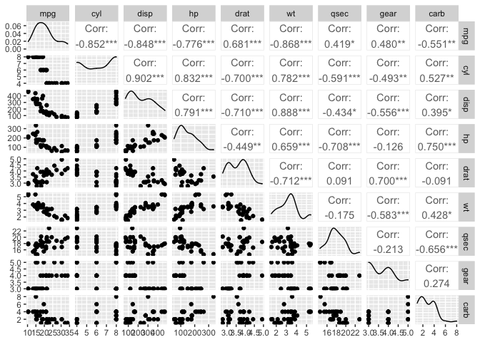
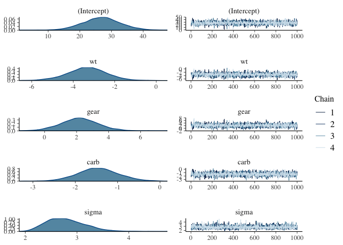
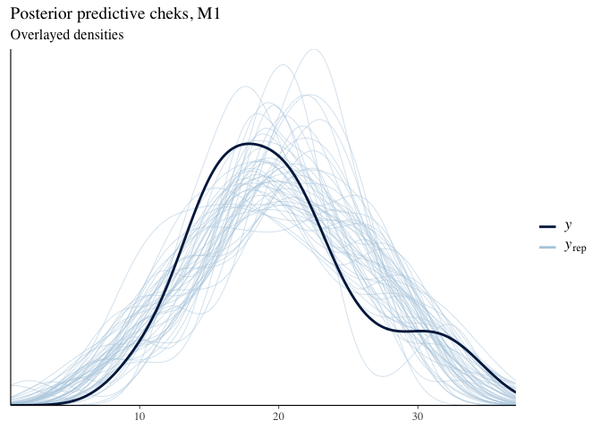
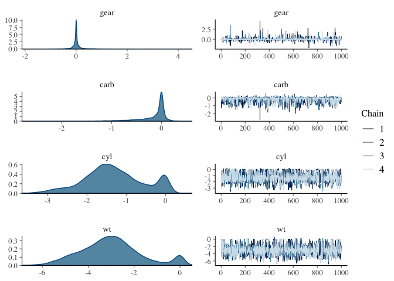
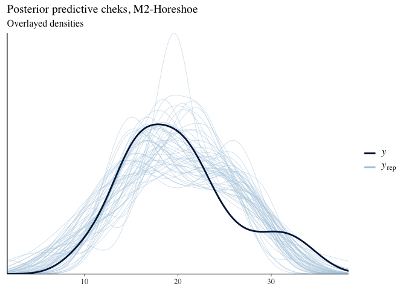
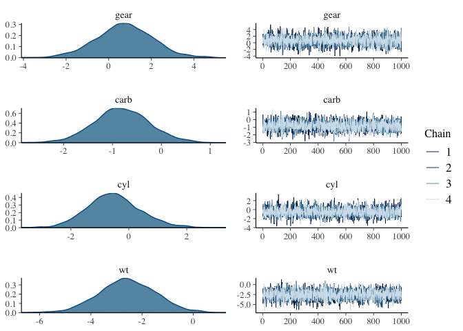
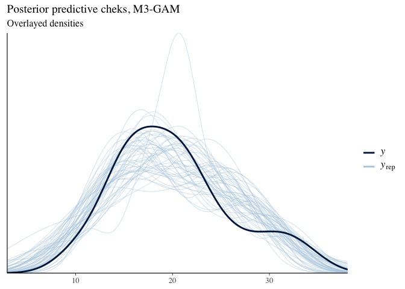
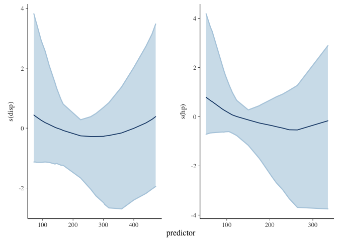

Capacidad de carros por consumo, parte 2
================
Asael Alonzo Matamoros
2022-12-12

La base de datos `mtcars` contiene el registro de motores de carros mas
populares en USA, 1974. los datos contienen 32 registros, con 10
atributos del motor.

``` r
library(GGally)
library(ggplot2)
library(rstanarm)
library(flextable)
library(bayesplot)

options(mc.cores = parallel::detectCores())
```

Se desea predecir la capacidad de consumo de los motores, para eso se
evaluaron las siguiente variables.

- `mpg`: Millas por Galón. (**Dependiente**)

- `hp`: Caballos de fuerza.

- `carb`: número de carburadores.

- `wt`: peso del motor.

- `gears`: Número de cambios.

- `vs`: tipo de motor, `recto:1` o `tipo V:0`.

- `disp`: El desplazamiento.

- `am`: transmisión, `automático:0` o `manual:1`.

- `cyl`: número de cilindros.

Todas las variables son numéricas, pero algunas son totalmente enteras,
dificultando el proceso de análisis, se procede a revisar las
correlaciones para revisar las interacciones lineales entre variables.

``` r
ggpairs(mtcars[,-c(8,9)])
```

<figure>

<figcaption aria-hidden="true">Figure 1: Gráfico de pares. La diagonal
principal muestra histogramas densidades de cada una de las variables.
La parte superior muestra el coeficiente de correlación entre dos
variables, fila y columna. La parte inferior muestra un gráfico de
dispersión entre dos variables.</figcaption>
</figure>

[Figure 1](#fig-pairs) muestra colinealidad entre las variables
`mpg, hp` y `wt`. Por lo tanto, múltiples modelos deben ser
considerados.

## Modelo inicial

Para medir la relación de consumo de los motores utilizaremos GLM normal
reducido obtenido en el [post anterior, modelo
M3](https://asael697.github.io/ABM/posts/Gaussian-LM/). Para las priors,
elegimos de tipo débil estándar, por lo tanto el modelo final es:

, \quad  g(\mu_i) = \mu_i, \text{ y } \mu_i = \beta X_i.")


Con priors:

,")

![\beta \_{\[1:3\]}\sim N(0,5),](https://latex.codecogs.com/svg.latex?%5Cbeta%20_%7B%5B1%3A3%5D%7D%5Csim%20N%280%2C5%29%2C "\beta _{[1:3]}\sim N(0,5),")

.")

El siguiente código corre un GLM Gaussiano, la sintaxis provista por el
paquete `rstanarm` es bastante similar a la sintaxis de la librería
estándar, con la diferencia de la especificación de las prior a
utilizar; ademas, se debe especificar el numero de cadenas a correr
`chains`, el numero de iteraciones por cadena `iter`, y el numero
inicial de iteraciones a remover `warm.up`. En este caso utilizaremos
los valores por defecto.

``` r
bm1 = stan_glm(mpg~wt+gear+carb,data = mtcars,
               prior = normal(0, 5),
               prior_intercept = student_t(4, 0, 10),
               prior_aux = cauchy(0, 3),
               refresh = 0)

summary(bm1)
```


    Model Info:
     function:     stan_glm
     family:       gaussian [identity]
     formula:      mpg ~ wt + gear + carb
     algorithm:    sampling
     sample:       4000 (posterior sample size)
     priors:       see help('prior_summary')
     observations: 32
     predictors:   4

    Estimates:
                  mean   sd   10%   50%   90%
    (Intercept) 26.9    6.1 19.2  26.9  34.6 
    wt          -3.3    1.0 -4.5  -3.3  -2.1 
    gear         2.2    1.2  0.7   2.2   3.7 
    carb        -1.5    0.5 -2.1  -1.5  -0.8 
    sigma        2.8    0.4  2.3   2.7   3.3 

    Fit Diagnostics:
               mean   sd   10%   50%   90%
    mean_PPD 20.1    0.7 19.2  20.0  20.9 

    The mean_ppd is the sample average posterior predictive distribution of the outcome variable (for details see help('summary.stanreg')).

    MCMC diagnostics
                  mcse Rhat n_eff
    (Intercept)   0.1  1.0  1762 
    wt            0.0  1.0  1663 
    gear          0.0  1.0  1798 
    carb          0.0  1.0  1770 
    sigma         0.0  1.0  2344 
    mean_PPD      0.0  1.0  3035 
    log-posterior 0.1  1.0  1136 

    For each parameter, mcse is Monte Carlo standard error, n_eff is a crude measure of effective sample size, and Rhat is the potential scale reduction factor on split chains (at convergence Rhat=1).

El algoritmo por defecto utilizado en `Stan` es un MCMC, ver Metropolis
et al. (1953) y Betancourt (2017); y por lo tanto, es necesario revisar
la convergencia de las cadenas simuladas. Los indicadores por defecto
son:

- **Monte Carlo standard error** (`mcse`): mide el error de la
  aproximación del estimador obtenido en métodos de Monte Carlo, y se
  calcula para la media
  ![E\[\theta \|y\]](https://latex.codecogs.com/svg.latex?E%5B%5Ctheta%20%7Cy%5D "E[\theta |y]").

- **Reducción de escala potencial,
  **
  (`Rhat`): compara las varianzas promedio de las cadenas con las
  varianzas inter-cadenas, valores aproximados a uno indican
  convergencia.

- **Effective sample size, ESS** (`n_eff`): Estima el tamaño de muestra
  de los estimadores asumiendo independencia, Este valor debe ser cercan
  al total de iteraciones realizado después del `warm.up`.

En nuestro modelo observamos que nuestros errores de M.C. son muy
cercanos a cero, los `Rhat` son todos uno, y los ESS son todos la mitad
del total de iteraciones. En general el modelo parece no tener
problemas, los ESS están un poco bajo, y esto se puede solventar
aumentando el número de iteraciones o incrementando el `warm.up`. Para
efectos de este estudio aceptaremos las aproximaciones obtenidas.

Una de las ventajas de los métodos Bayesianos es que permite evaluar la
incertidumbre de los estimadores de forma automática. El resultado del
código anterior muestra los intervalos de credibilidad al 90%.

``` r
mcmc_combo(x = bm1)
```

<figure>

<figcaption aria-hidden="true">Figure 2: Graficos de las posteriors. la
columna izquierda muesrta las densidades de cada uno de los parámetros.
En la columna derecha se muestran los traceplots, que son las
simlaciones de las diferentes cadenas.</figcaption>
</figure>

Es fácil visualizar las posteriors aproximadas mediante las cadenas
obtenidas. [Figure 2](#fig-post) muestra los gráficos de densidad para
cada uno de los parámetros y en la columna derecha muestra las cadenas
simuladas, las cuales se han mezclado y lucen estacionarias, indicando
convergencia.

``` r
pp_check(bm1)+labs(title = "Posterior predictive cheks, M1",
                   subtitle = "Overlayed densities")
```

<figure>

<figcaption aria-hidden="true">Figure 3: Gráfico de densidades
sobrepuestos. Se comparan una muestra de la densidad predictiva
<em>yrep</em> con la muestra de los datos <em>y</em> mediante
densidades. Las densidades esta sobrepuestas muestran un buen ajuste del
modelo.</figcaption>
</figure>

Finalmente, revisamos el ajusto del modelo, para eso usamos posterior
predictive checks, la idea es comparar la distribución de la densidad
predictiva del modelo con la densidad aproximada de la muestra.
[Figure 3](#fig-ppc) muestra la comparación de ambas densidades,
ilustrando un buen ajuste del modelo.

## Modelo completo con Horseshoe prior

El nuevo modelo a considerar es un GLM Gaussiano, agregando mas
covariables y utilizando un prior regularizadora de `Horseshoe` para las
covariables. Por lo tanto el modelo es:

, \quad  g(\mu_i) = \mu_i, \text{ y } \mu_i = \beta X_i.")


Con priors:

,")

,")

![\beta \_{\[1:6\]}\sim N(0,\tau^2 \_{\[1:6\]} \sigma^2\_\beta),](https://latex.codecogs.com/svg.latex?%5Cbeta%20_%7B%5B1%3A6%5D%7D%5Csim%20N%280%2C%5Ctau%5E2%20_%7B%5B1%3A6%5D%7D%20%5Csigma%5E2_%5Cbeta%29%2C "\beta _{[1:6]}\sim N(0,\tau^2 _{[1:6]} \sigma^2_\beta),")

![\tau^2 \_{\[1:6\]} \sim Cauchy\_+(0,1); \quad E\[\sigma^2\_\beta\] = 0.01, \\ V\[\sigma^2\_\beta\] = 4.](https://latex.codecogs.com/svg.latex?%5Ctau%5E2%20_%7B%5B1%3A6%5D%7D%20%5Csim%20Cauchy_%2B%280%2C1%29%3B%20%5Cquad%20E%5B%5Csigma%5E2_%5Cbeta%5D%20%3D%200.01%2C%20%5C%20V%5B%5Csigma%5E2_%5Cbeta%5D%20%3D%204. "\tau^2 _{[1:6]} \sim Cauchy_+(0,1); \quad E[\sigma^2_\beta] = 0.01, \ V[\sigma^2_\beta] = 4.")

En este caso los valores globales `df` y `scale`, son hiper-parámetros
que “regularizan” la `Horseshoe` prior a través de sus primeros dos
momentos, para un mejor ajuste. El siguiente código presenta el modelo
. Debido a
problemas de convergencia del modelo, es necesario aumentar
`adapt_delta` de NUTS para un mejor salto en el HMC.

``` r
bm2 = stan_glm(mpg~wt+gear+carb+vs+cyl+am,data = mtcars,
               prior = hs(df = 1,global_df = 4,global_scale = 0.01),
               prior_intercept = student_t(4, 0, 10),
               prior_aux = cauchy(0, 3),
               refresh = 0,adapt_delta = 0.99)

summary(bm2)
```


    Model Info:
     function:     stan_glm
     family:       gaussian [identity]
     formula:      mpg ~ wt + gear + carb + vs + cyl + am
     algorithm:    sampling
     sample:       4000 (posterior sample size)
     priors:       see help('prior_summary')
     observations: 32
     predictors:   7

    Estimates:
                  mean   sd   10%   50%   90%
    (Intercept) 38.0    2.9 34.7  38.2  41.3 
    wt          -3.0    1.3 -4.7  -3.0  -1.2 
    gear         0.0    0.3 -0.1   0.0   0.2 
    carb        -0.1    0.3 -0.5   0.0   0.0 
    vs           0.1    0.5 -0.1   0.0   0.3 
    cyl         -1.3    0.8 -2.2  -1.4  -0.1 
    am           0.1    0.5 -0.1   0.0   0.3 
    sigma        2.8    0.4  2.3   2.8   3.4 

    Fit Diagnostics:
               mean   sd   10%   50%   90%
    mean_PPD 20.1    0.7 19.1  20.1  21.0 

    The mean_ppd is the sample average posterior predictive distribution of the outcome variable (for details see help('summary.stanreg')).

    MCMC diagnostics
                  mcse Rhat n_eff
    (Intercept)   0.1  1.0  1680 
    wt            0.0  1.0   875 
    gear          0.0  1.0  2791 
    carb          0.0  1.0  1747 
    vs            0.0  1.0  1270 
    cyl           0.0  1.0   896 
    am            0.0  1.0  1964 
    sigma         0.0  1.0  1568 
    mean_PPD      0.0  1.0  4029 
    log-posterior 0.1  1.0  1120 

    For each parameter, mcse is Monte Carlo standard error, n_eff is a crude measure of effective sample size, and Rhat is the potential scale reduction factor on split chains (at convergence Rhat=1).

Los indicadores convergencia parecen bien excepto para los coeficientes
`wt` y `cyl` que son los valores no nulos del modelo, que debido a ser
valores atípicos y que este tipo de priors fuerzan a cero los
coeficientes, es natural que el HMC tenga problemas para explorar la
posterior de estos parámetros.

``` r
mcmc_combo(x = bm2,pars = c("gear","carb","cyl","wt"))

rstanarm::pp_check(bm2)+labs(title = "Posterior predictive cheks, M2-Horeshoe",
                   subtitle = "Overlayed densities")
```

<figure>

<figcaption aria-hidden="true">Figure 4: Gráfico para las posteriors y
traceplots de los parámetros nulos.</figcaption>
</figure>

<figure>

<figcaption aria-hidden="true">Figure 5: Posterior predictive checks:
densidades sobre-puestas.</figcaption>
</figure>

Graficos de diagnósticos para el modelo completo con prior
regularizadora de Horseshoe. Se presetan las densidades y traceplots de
dos parametros con posteriors regularizadas (Nulas), y dos posteriors
significativas. El gráfico derecho es un diagnóstico del ajuste del
modelo usando densidades sobre-puestas; comparando una muestra de la
densidad predictiva *yrep* con la muestra de los datos *y*

**?@fig-diag2** parte (a) muestra las posteriors y traceplots para dos
parámetros nulos (`gear` y `carb`) y dos parámetros significativos
(`cyl` y `wt`). Los coeficientes nulos tienen posteriors con colas muy
pesadas como se esperaba, pero los otros dos coeficientes tiene
posteriors multi-modales indicando problemas de identificación u
convergencia, para descartar el segundo problema se recomienda correr un
mayor número de iteraciones. La parte (b) muestra el ajuste del modelo,
que se observa un mejor ajuste que el modelo anterior.

## Modelo GAM completo

, \quad  g(\mu_i) = \mu_i,\ \text{y } \mu_i = f_1(x_i)+f_2(hp_i)+f_3(disp_i),")

donde:

 = \beta_0 + \beta_1 wt+ \beta_2 gear + \beta_3 carb + \beta_4 vs +\beta_5 cyl +\beta_6 am,")

 = \sum_{s=1}^{10}\beta_s b_s(hp), \ y \ f_3(disp_i) = \sum_{s=1}^{10}\beta_s b_s(disp).")

Con priors:

,")

![\beta \_{\[1:26\]}\sim N(0,5),](https://latex.codecogs.com/svg.latex?%5Cbeta%20_%7B%5B1%3A26%5D%7D%5Csim%20N%280%2C5%29%2C "\beta _{[1:26]}\sim N(0,5),")

.")

El siguiente código presenta el modelo
.

``` r
bm3 = stan_gamm4(mpg~wt+gear+carb+vs+cyl+am+s(hp)+s(disp),data = mtcars,
               prior = normal(0,5),
               prior_intercept = student_t(4, 0, 10),
               prior_aux = cauchy(0, 3),
               refresh = 0)
```

Dado que el numero de parámetros registrado es muy grande no
presentaremos el resumen del modelo. Con respecto al diagnóstico de la
aproximación MCMC, presentamos valores máximos, el mayor `mcse` fue de
0.2, todos los `Rhat` fueron igual a uno; y el menor `ess` fue de 1,224
iteraciones. Por lo tanto, aceptamos la aproximación obtenida.

``` r
mcmc_combo(x = bm3,pars = c("gear","carb","cyl","wt"))

rstanarm::pp_check(bm3)+labs(title = "Posterior predictive cheks, M3-GAM",
                   subtitle = "Overlayed densities")
```

<figure>

<figcaption aria-hidden="true">Figure 6: Gráfico para las posteriors y
traceplots de los parámetros nulos.</figcaption>
</figure>

<figure>

<figcaption aria-hidden="true">Figure 7: Posterior predictive checks:
densidades sobre-puestas.</figcaption>
</figure>

Graficos de diagnósticos para el modelo completo con prior
regularizadora de Horseshoe. Se presetan las densidades y traceplots de
los parametros lineales. El gráfico derecho es un diagnóstico del ajuste
del modelo usando densidades sobre-puestas; comparando una muestra de la
densidad predictiva *yrep* con la muestra de los datos *y*

**?@fig-diag3** muestra las densidades y traceplots para todos los
parámetros lineales, donde observamos convergencia y densidades
unimodales. La parte derecha muestra el ajuste del modelo, con
densidades sobre-puestas presentando un buen ajuste del modelo
.
[Figure 8](#fig-nl) muestra los efectos no lineales marginales del
modelo para las covariables `hp` y `disp`. Los efectos marginales son
suaves y casi constantes, indicando que el aporte no lineal es muy poco.

``` r
plot_nonlinear(bm3)
```

<figure>

<figcaption aria-hidden="true">Figure 8: Efectos marginales no lineales.
Estos graficos presentan las relacionnes no lineales de las variables
designadas con los datos.</figcaption>
</figure>

## Leave-One-Out-Cross-Validation

Para evaluar el aprendizaje de cada modelo estimaremos la expected
log-predictive density (`elpd`) de cada modelo usando `LOO`, Vehtari et
al. (2015), los modelos que consideraremos son cuatro:

-  Modelo
  Gaussiano reducido.

-  Modelo
  Gaussiano completo, `Horseshoe` prior.

-  Modelo
  Generalizado aditivo Gaussiano completo

-  Modelo
  Gaussiano completo, `LASSO` prior.

El siguiente código muestra del modelo
 con un prior
regularizadora de tipo LASSO. Con respecto al ajuste, el mayor `mcse`
fue de 0.1. Todos los `Rhat` fueron igual a uno, y el menor `ess` fue de
1,230 iteraciones. A diferencia del modelo `Horseshoe`
(), este modelo no
encontró covariables nulas, todas las variables aportan algo al modelo,
por lo tanto falla en regularizar los parámetros.

**Importante:** Que este modelo no regularice no implica que falle o es
incorrecto. Este fenómeno se debe a que la prior `LASSO` tiene colas
menos pesadas que la `Horseshoe` y por ende es más flexible.

``` r
bm4 = stan_glm(mpg~wt+gear+carb+vs+cyl+am,data = mtcars,
               prior = lasso(df = 1,location = 0,autoscale = TRUE),
               prior_intercept = student_t(4, 0, 10),
               prior_aux = cauchy(0, 3),
               refresh = 0,adapt_delta = 0.99)
```

Ajustamos `LOO` para cada uno del modelo aproximando la `elpd` con
muestreo por importancia de tipo Pareto (`PISIS`), en caso que una de
las observaciones `PISIS` no converja
(),
esta será calculada re ajustando el modelo nuevamente solamente en esa
observación.

``` r
loo1 = loo(bm1,k_threshold = 0.7)
loo2 = loo(bm2,k_threshold = 0.7)
loo3 = loo(bm3,k_threshold = 0.7)
loo4 = loo(bm4,k_threshold = 0.7)

loo_compare(loo1,loo2,loo3,loo4)
```

        elpd_diff se_diff
    bm4  0.0       0.0   
    bm3  0.0       1.0   
    bm2 -1.0       1.7   
    bm1 -1.3       2.8   

Los resultados muestran que el mejor modelo es el modelo aditivo
Generalizado (GAM) completo
 indicando que los
efectos no lineales si influyen en el ajuste y predicción del modelo.

## Referencias

<div id="refs" class="references csl-bib-body hanging-indent">

<div id="ref-betancourt2017" class="csl-entry">

Betancourt, Michael. 2017. “A Conceptual Introduction to Hamiltonian
Monte Carlo.” <https://arxiv.org/abs/1701.02434>.

</div>

<div id="ref-Casella" class="csl-entry">

Casella, George, and Roger Berger. 2001. *Statistical Inference*.
Duxbury Resource Center.
<http://www.amazon.fr/exec/obidos/ASIN/0534243126/citeulike04-21>.

</div>

<div id="ref-degroot2012" class="csl-entry">

DeGroot, M. H., and M. J. Schervish. 2012. *Probability and Statistics*.
Addison-Wesley. <https://books.google.es/books?id=4TlEPgAACAAJ>.

</div>

<div id="ref-gelman2013" class="csl-entry">

Gelman, A., J. B. Carlin, H. S. Stern, D. B. Dunson, A. Vehtari, and D.
B. Rubin. 2013. *Bayesian Data Analysis, Third Edition*. Chapman &
Hall/CRC Texts in Statistical Science. Taylor & Francis.
<https://books.google.nl/books?id=ZXL6AQAAQBAJ>.

</div>

<div id="ref-gelman2020bayesian" class="csl-entry">

Gelman, Andrew, Aki Vehtari, Daniel Simpson, Charles C. Margossian, Bob
Carpenter, Yuling Yao, Lauren Kennedy, Jonah Gabry, Paul-Christian
Bürkner, and Martin Modrák. 2020. “Bayesian Workflow.”
<https://arxiv.org/abs/2011.01808>.

</div>

<div id="ref-BMCP2021" class="csl-entry">

Martin, Osvaldo A., Ravin Kumar, and Junpeng Lao. 2021. *<span
class="nocase">Bayesian Modeling and Computation in Python</span>*. Boca
Raton.

</div>

<div id="ref-metropolis1953" class="csl-entry">

Metropolis, Nicholas, Arianna W. Rosenbluth, Marshall N. Rosenbluth,
Augusta H. Teller, and Edward Teller. 1953. “Equation of State
Calculations by Fast Computing Machines.” *The Journal of Chemical
Physics* 21 (6): 1087–92. <https://doi.org/10.1063/1.1699114>.

</div>

<div id="ref-Miggon2014" class="csl-entry">

Migon, Helio, Dani Gamerman, and Francisco Louzada. 2014. *Statistical
Inference. An Integrated Approach*. Chapman and Hall CRC Texts in
Statistical Science. Chapman; Hall.

</div>

<div id="ref-BMLR2021" class="csl-entry">

Roback, paul., and Julie. Legler. 2021. *<span class="nocase">Beyond
Multiple Linear Regression: Applied Generalized Linear Models an
Multilevel Models in R</span>*. Boca Raton.

</div>

<div id="ref-vehtari2016" class="csl-entry">

Vehtari, Aki, Daniel Simpson, Andrew Gelman, Yuling Yao, and Jonah
Gabry. 2015. “Pareto Smoothed Importance Sampling.”
<https://arxiv.org/abs/1507.02646>.

</div>

</div>
