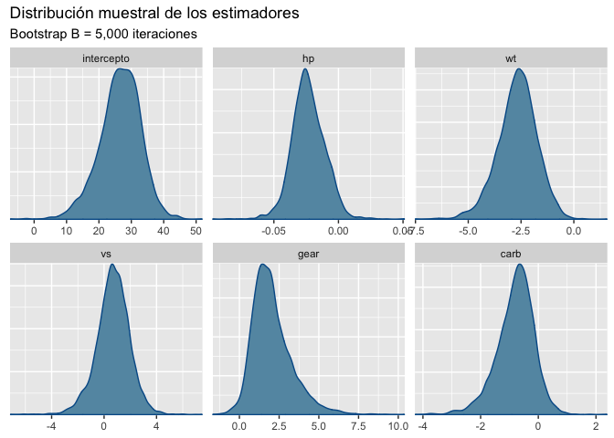

Capacidad de carros por consumo
================
Asael Alonzo Matamoros
2022-11-16

La base de datos `mtcars` contiene el registro de motores de carros mas
populares en USA, 1974. los datos contienen 32 registros, con 10
atributos del motor.

``` r
library(caret)
library(GGally)
library(ggplot2)
library(flextable)
library(bayesplot)
library(ggfortify)
```

Se desea predecir la capacidad de consumo de los motores, para eso se
evaluaron las siguiente variables.

- `mpg`: Millas por Galón. (**Dependiente**)

- `hp`: Caballos de fuerza.

- `carb`: número de carburadores.

- `wt`: peso del motor.

- `gears`: Número de cambios.

- `vs`: tipo de motor, `recto:1` o `tipo V:0`.

## Verosimilitud

Para medir la relación de consumo de los motores utilizaremos un GLM
normal tal que:

, \quad  g(\mu_i) = \mu_i, \text{ y } \mu_i = \beta X_i.")

El siguiente código limpia la base de datos para obtener las variables
de interés

``` r
df = mtcars[,c(1,4,6,8,10,11)]
str(df)
```

    'data.frame':   32 obs. of  6 variables:
     $ mpg : num  21 21 22.8 21.4 18.7 18.1 14.3 24.4 22.8 19.2 ...
     $ hp  : num  110 110 93 110 175 105 245 62 95 123 ...
     $ wt  : num  2.62 2.88 2.32 3.21 3.44 ...
     $ vs  : num  0 0 1 1 0 1 0 1 1 1 ...
     $ gear: num  4 4 4 3 3 3 3 4 4 4 ...
     $ carb: num  4 4 1 1 2 1 4 2 2 4 ...

Todas las variables son numéricas, pero algunas son totalmente enteras,
dificultando el proceso de análisis, se procede a revisar las
correlaciones para revisar las interacciones lineales entre variables.

``` r
ggpairs(df)
```

<figure>

<figcaption aria-hidden="true">Figure 1: Gráfico de pares. La diagonal
principal muestra histogramas densidades de cada una de las variables.
La parte superior muestra el coeficiente de correlación entre dos
variables, fila y columna. La parte inferior muestra un gráfico de
dispersión entre dos variables.</figcaption>
</figure>

[Figure 1](#fig-pairs) muestra colinealidad entre las variables
`mpg, hp` y `wt`. Por lo tanto, múltiples modelos deben ser
considerados. Realizemos un modelo inicial, el considerado el modelo
completo que posee todas las variables

<div>

> **Colinealidad**
>
> Dos covariables 
> y  se dicen ser
> **colineales** si las variables son **linealmente dependientes**.
>
> Recordar que si dos columnas de una matriz son linealmente
> dependiente, entonces el determinante es cero.

</div>

## Ajuste del modelo

Ajustamos el modelo completo que consiste en usar todas las variables, y
revisamos el ajuste e inferencia de los parámetros.

``` r
m1 = lm(mpg~.,data = df)
summary(m1)
```


    Call:
    lm(formula = mpg ~ ., data = df)

    Residuals:
        Min      1Q  Median      3Q     Max 
    -3.2884 -1.4370 -0.3155  1.1697  5.8246 

    Coefficients:
                Estimate Std. Error t value Pr(>|t|)    
    (Intercept) 27.20311    5.74212   4.737 6.72e-05 ***
    hp          -0.02339    0.01353  -1.728   0.0958 .  
    wt          -2.74663    0.92005  -2.985   0.0061 ** 
    vs           0.94692    1.36929   0.692   0.4954    
    gear         1.78520    1.12762   1.583   0.1255    
    carb        -0.65498    0.57767  -1.134   0.2672    
    ---
    Signif. codes:  0 '***' 0.001 '**' 0.01 '*' 0.05 '.' 0.1 ' ' 1

    Residual standard error: 2.569 on 26 degrees of freedom
    Multiple R-squared:  0.8477,    Adjusted R-squared:  0.8184 
    F-statistic: 28.94 on 5 and 26 DF,  p-value: 7.653e-10

Debido a la alta colinealidad entre las variables, pocos parámetros
estimados son significativos. Procedemos a eliminar algunas variables
del modelo. Eliminamos la variable `wt` al ser colineal con múltiples
variables. Por lo tanto, el modelo inicial
 es:

``` r
m1  =  lm(mpg~vs+hp+gear+carb,data = df)
summary(m1)
```


    Call:
    lm(formula = mpg ~ vs + hp + gear + carb, data = df)

    Residuals:
        Min      1Q  Median      3Q     Max 
    -3.8047 -2.3487 -0.0967  1.9188  6.7859 

    Coefficients:
                Estimate Std. Error t value Pr(>|t|)    
    (Intercept) 13.03756    3.67694   3.546  0.00145 ** 
    vs           0.84671    1.55657   0.544  0.59093    
    hp          -0.03449    0.01480  -2.331  0.02747 *  
    gear         4.20129    0.89285   4.705 6.72e-05 ***
    carb        -1.33338    0.60391  -2.208  0.03593 *  
    ---
    Signif. codes:  0 '***' 0.001 '**' 0.01 '*' 0.05 '.' 0.1 ' ' 1

    Residual standard error: 2.921 on 27 degrees of freedom
    Multiple R-squared:  0.7955,    Adjusted R-squared:  0.7652 
    F-statistic: 26.25 on 4 and 27 DF,  p-value: 5.825e-09

## Incertidumbre de los estimadores.

Pese que la función `lm` de `R` realiza un análisis de incertidumbre al
presentar una *Prueba-t* de significacia para cada parámetro
, no
presenta los intervalos de confianza. Estos serán estimados con
**Bootstrap**. La siguiente función obtiene una muestra Bootstrap de los
parámetros desconocidos
.

``` r
lm_boots = function(y,x,B = 1000){
  n = length(y)
  est = NULL
  for (i in 1:B) {
    si = sample(x = 1:n,size = n,replace = TRUE)
    mli = lm(y[si]~x[si,] )
    ci = as.array(mli$coefficients)
    est = rbind(est,ci)
  }
  # Estética
  cn = colnames(x)
  colnames(est) = c("intercepto",cn)
  
  return(est)
}
```

Obtenemos una muestra Bootstrap para los estimadores

de tamaño

repeticiones

``` r
btp = lm_boots(y = df$mpg,x = as.matrix(df[,-1]),B = 5000)

bayesplot_theme_set(theme_grey())
mcmc_dens(btp)+labs(title="Distribución muestral de los estimadores",
                    subtitle ="Bootstrap B = 5,000 iteraciones")
```

<figure>

<figcaption aria-hidden="true">Figure 2: Gráfico de densidades. Cada
densidad representa la distribución muestral aproximada para cada uno de
los estimadores usando un Bootstrap de B=5,000 iteraciones.</figcaption>
</figure>

Los intervalos de confianza al 95% son:

``` r
x = apply(btp,MARGIN = 2, FUN = quantile, probs = c(0.025,0.5,0.975)) 

# Estética
x = data.frame( t(x) )
x$pars = c("intercepto","hp","wt","vs","gear","carb")
colnames(x) = c("q2.5%","Median","q97.5%","parámetros")

ft = flextable(x[c(4,1,2,3)])
autofit(ft)
```

Los intervalos de confianza revelan mayor información a lo obtenido por
la prueba-t, parámetros como `hp`, y `carb` que son significativos en la
prueba, no lo son mediante los intervalos. Esto indica la posibilidad de
un modelo mucho mas reducido.

## Análisis de los residuos

Una vez evaluadas las estimaciones del modelo, es necesario revisar los
residuos del mismo para corroborar supuestos, la siguiente linea de
código presenta un resumen descriptivo de los residuos del modelo
inicial , en su
mayoría parecen estar centrados en cero.

``` r
summary(m1$residuals)
```

        Min.  1st Qu.   Median     Mean  3rd Qu.     Max. 
    -3.80470 -2.34875 -0.09674  0.00000  1.91880  6.78592 

[Figure 3](#fig-res1) presenta una visualización típica para el
diagnostico de los residuos, ninguna figura debe presentar un
comportamiento polinómico a excepción del gráfico de quantiles (*derecha
superior*), que debe seguir el comportamiento de una función lineal
creciente.

``` r
autoplot(m1)
```

<figure>

<figcaption aria-hidden="true">Figure 3: Gráfico diagnóstico de los
residuos, estos cuatro gráficos evaluan el ajuste y supuestos del
modelo, si algún comportamiento polinómico es persistente, entonces los
supuestos del modelo no se satisfacen.</figcaption>
</figure>

## Selección de modelos

Adicional al modelo
, ajustamos dos
modelos mas:

,")

.")

``` r
m2 = lm(mpg~hp+gear+carb,data = df)
m3 = lm(mpg~wt+gear+carb,data = df)
```

El siguiente código calcula el
 de un modelo
linea en el conjunto de entrenamiento.

``` r
rmse = function(m){
  mse = sum(m$residuals^2)/length(m$residuals)
  return(sqrt(mse))
}
```

``` r
x = matrix(0,nrow = 4,ncol = 3)
x[1,] = c(logLik(m1),logLik(m2),logLik(m3))
x[2,] = c(AIC(m1),AIC(m2),AIC(m3))
x[3,] = c(BIC(m1),BIC(m2),BIC(m3))
x[4,] = c(rmse(m1),rmse(m2),rmse(m3))

# Estética
x = data.frame(x)
x$pars =  c("logLik","AIC","BIC","RMSE")
colnames(x)  = c("Modelo 1","Modelo 2","Modelo 3","Criterio")

ft = flextable(x[c(4,1,2,3)])
autofit(ft)
```

**?@tbl-criteria** muestra la tabla de criterios de información para el
conjunto de datos `mtcars` para sorpresa del lector el mejor modelo es
el alternativo 
que usa la variable colineal `wt` en vez de `hp`.

## Validación cruzada

``` r
kfold = function(df,k){
  # Generar la particion
  kfld = createFolds(df[,1],k = k)
  mat = NULL
  
  for (i in 1:k) {
    # separar los datos en conjuntos de prueba y entrenamiento
    dfE= df[-kfld[[i]],]
    dfP = df[kfld[[i]],]
    # Ajustar los modelos
    m1 = lm(mpg~vs+hp+gear+carb,data = dfE)
    m2 = lm(mpg~hp+gear+carb,data = dfE)
    m3 = lm(mpg~wt+gear+carb,data = dfE)
    
    p1 = predict(m1,dfP)
    p2 = predict(m2,dfP)
    p3 = predict(m3,dfP)
    # Calcular AIC y RMSE
    aic = c(
            AIC(m1),
            AIC(m2),
            AIC(m3)
            )
    rmse = c(
             RMSE(pred =  p1,obs = dfP[,1]),
             RMSE(pred =  p2,obs = dfP[,1]),
             RMSE(pred =  p3,obs = dfP[,1])
             )
    mae = c(
            MAE(pred =  p1,obs = dfP[,1]),
            MAE(pred =  p2,obs = dfP[,1]),
            MAE(pred =  p3,obs = dfP[,1])
            )
    mape = c(
              mean(abs((p1-dfP[,1])/dfP[,1])),
              mean(abs((p2-dfP[,1])/dfP[,1])),
              mean(abs((p3-dfP[,1])/dfP[,1]))
              )
    # Unir los datos
    mat = rbind(mat,c(aic,rmse,mae,mape)) 
  }
  colnames(mat) = c("AIC1","AIC2","AIC3","RMSE1","RMSE2","RMSE3","MAE1","MAE2",
                    "MAE3","MAPE1","MAPE2","MAPE3")
  row.names(mat) = NULL
  return(mat)
}
```

``` r
rst = kfold(df = df,k = 5)
t(apply(rst,MARGIN = 2,FUN = "quantile",probs = c(0.025,0.5,0.975)))
```

                  2.5%         50%       97.5%
    AIC1  129.64744966 136.5511491 138.4419206
    AIC2  128.24468542 134.7125490 136.6309648
    AIC3  125.97824024 130.9608223 133.5226853
    RMSE1   2.39159580   2.9315220   3.8228189
    RMSE2   2.33494874   2.9690151   3.7850216
    RMSE3   2.03221634   2.8639901   3.7099161
    MAE1    1.94909529   2.7451468   3.2311900
    MAE2    1.82578793   2.7415632   3.2052844
    MAE3    1.62540202   1.8581509   2.7090067
    MAPE1   0.10467859   0.1375552   0.1698492
    MAPE2   0.09899415   0.1331629   0.1711344
    MAPE3   0.09219366   0.1024701   0.1288014

## Referencias

<div id="refs" class="references csl-bib-body hanging-indent">

<div id="ref-Casella" class="csl-entry">

Casella, George, and Roger Berger. 2001. *Statistical Inference*.
Duxbury Resource Center.
<http://www.amazon.fr/exec/obidos/ASIN/0534243126/citeulike04-21>.

</div>

<div id="ref-degroot2012" class="csl-entry">

DeGroot, M. H., and M. J. Schervish. 2012. *Probability and Statistics*.
Addison-Wesley. <https://books.google.es/books?id=4TlEPgAACAAJ>.

</div>

<div id="ref-gelman2013" class="csl-entry">

Gelman, A., J. B. Carlin, H. S. Stern, D. B. Dunson, A. Vehtari, and D.
B. Rubin. 2013. *Bayesian Data Analysis, Third Edition*. Chapman &
Hall/CRC Texts in Statistical Science. Taylor & Francis.
<https://books.google.nl/books?id=ZXL6AQAAQBAJ>.

</div>

<div id="ref-Miggon2014" class="csl-entry">

Migon, Helio, Dani Gamerman, and Francisco Louzada. 2014. *Statistical
Inference. An Integrated Approach*. Chapman and Hall CRC Texts in
Statistical Science. Chapman; Hall.

</div>

<div id="ref-BMLR2021" class="csl-entry">

Roback, paul., and Julie. Legler. 2021. *<span class="nocase">Beyond
Multiple Linear Regression: Applied Generalized Linear Models an
Multilevel Models in R</span>*. Boca Raton.

</div>

</div>
