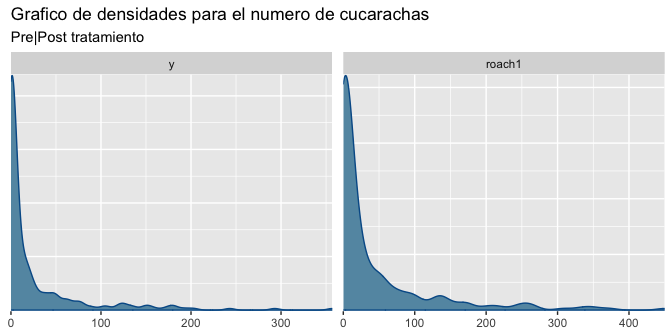
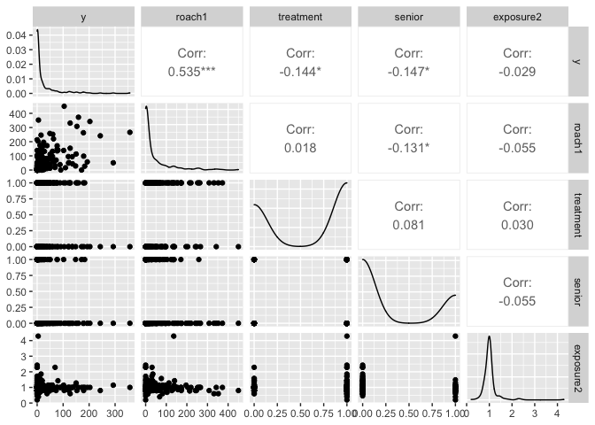
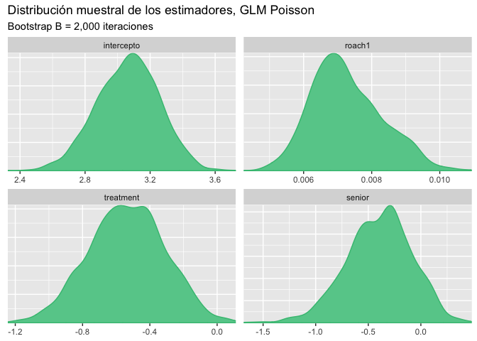
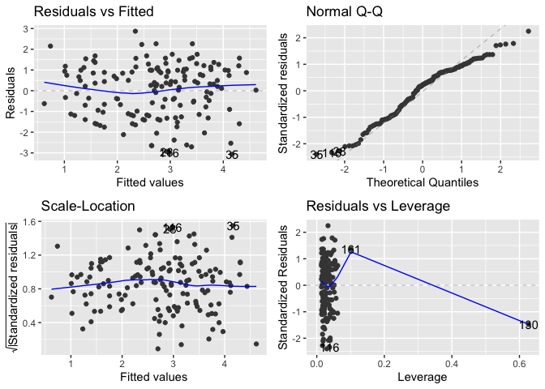
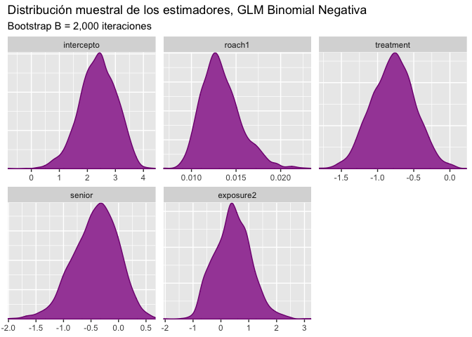

Tratamiento para cucarachas
================
Asael Alonzo Matamoros
2022-11-17

Se desea establecer la eficacia de cierto pesticida para el reducir el
número de cucarachas en apartamentos urbanos. El tratamiento se aplicó a
158 de 262 apartamentos,
 es el número de
cucarachas atrapadas después de aplicar dicho tratamiento.

``` r
library(caret)
library(GGally)
library(ggplot2)
library(rstanarm)
library(flextable)
library(bayesplot)
library(ggfortify)

bayesplot_theme_set(theme_grey())

data(roaches)
```

Los resultados del estudio se almacenan en la base de datos `roaches`,
que contiene las siguiente variables.

- `y`: número de cucarachas, después de aplicar el tratamiento.
  (**Dependiente**)

- `roach1`: Número de cucarachas inicial.

- `treatment`: Indicador de si recibió el tratamiento.

- `senior`: Indicador si el residente era mayor.

- `eposure2`: Número de días que se aplicó el tratamiento.

## Verosimilitud

La variable `y` representa el numero de cucarachas registradas al
finalizar el tratamiento, dicha característica es representada por una
v.a. discreta y positiva, y dicha característica debe ser considerada en
el modelo.

``` r
mcmc_dens(roaches,pars = c("y","roach1"))+
  labs(title = "Grafico de densidades para el numero de cucarachas",
       subtitle = "Pre|Post tratamiento")
```

<figure>

<figcaption aria-hidden="true">Figure 1: Gráfico dedenisdades e
intervalos. El gráfico izquierdo presenta las densidades de las dos
variables de interes, el número de cucarachas previo y post exposición
al tratamiento. La parte izquierda muestra las cajas de los datos, donde
el punto representa la mediana y la caja gruesa representa los
cuartiles. Ambas variables muestran medias centradas en cero pero con
colas bastante pesadas.</figcaption>
</figure>

[Figure 1](#fig-dens) muestra que ambas variables `y` y `roach1` son
positivas, con colas derechas muy pesadas, para este tipo de datos
existen dos alternativas:

- Modelar los datos con una distribución
  ").

- Modelar los datos con GLMs de conteo

En GLMs de conteo, la distribución mas popular debido a su simpleza es
Poisson pero con una fuerte limitación que los datos poseen media y
varianza iguales. Para medir los efectos del tratamiento mediante un GLM
de conteo de Poisson definimos la verosimilitud de tal forma que:

,\quad g(\mu_i) = \log(\mu_i), \text{ y } \mu_i = \mu_0e^{\beta X_i}.")

Donde:

-  se le
  conoce como la información previo a la exposición.

- ,
  es la función de enlace logarítmica
   = \log x")

- y  son las
  covariables.

En un modelo log-normal, asumimos que los datos en escala logaritmica
siguen un modelo normal

, \quad  g(\mu_i) = \mu_i, \text{ y } \mu_i = \beta X_i.")

Es importante tener en cuenta que la función logarítmica es convexa, por
ende no se puede aplicar la transformación inversa para obtener las
predicciones en las escalas originales. Recordar que si
")
entonces:

![E\[y\] = e^{\mu +1/2\sigma}.](https://latex.codecogs.com/svg.latex?E%5By%5D%20%3D%20e%5E%7B%5Cmu%20%2B1%2F2%5Csigma%7D. "E[y] = e^{\mu +1/2\sigma}.")

Finalmente realizamos un gráfico de correlaciones para identificar las
interacciones lineales entre variables.

``` r
ggpairs(roaches )
```

<figure>

<figcaption aria-hidden="true">Figure 2: Gráfico de pares. La diagonal
principal muestra histogramas densidades de cada una de las variables.
La parte superior muestra el coeficiente de correlación entre dos
variables, fila y columna. La parte inferior muestra un gráfico de
dispersión entre dos variables.</figcaption>
</figure>

[Figure 2](#fig-pairs) muestra resultados anti-intuitivos, se esperaría
una alta correlación entre las variables `y` y `roach1`, dado que ambas
miden la misma información pero en tiempos diferentes. Dado la poca
correlación entre las variables consideramos un modelo completo que
incluya todas las interacciones en el modelo.

## Ajuste del modelo de Conteo de Poisson

Ajustamos el modelo GLM de conteo completo que consiste en usar todas
las variables, y revisamos el ajuste e inferencia de los parámetros.

``` r
m1  = glm(y ~ roach1 + treatment + senior, offset = log(exposure2),
            data = roaches, family = poisson)

summary(m1)
```


    Call:
    glm(formula = y ~ roach1 + treatment + senior, family = poisson, 
        data = roaches, offset = log(exposure2))

    Deviance Residuals: 
         Min        1Q    Median        3Q       Max  
    -17.9430   -5.1529   -3.8059    0.1452   26.7771  

    Coefficients:
                  Estimate Std. Error z value Pr(>|z|)    
    (Intercept)  3.089e+00  2.123e-02  145.49   <2e-16 ***
    roach1       6.983e-03  8.874e-05   78.69   <2e-16 ***
    treatment   -5.167e-01  2.474e-02  -20.89   <2e-16 ***
    senior      -3.799e-01  3.342e-02  -11.37   <2e-16 ***
    ---
    Signif. codes:  0 '***' 0.001 '**' 0.01 '*' 0.05 '.' 0.1 ' ' 1

    (Dispersion parameter for poisson family taken to be 1)

        Null deviance: 16954  on 261  degrees of freedom
    Residual deviance: 11429  on 258  degrees of freedom
    AIC: 12192

    Number of Fisher Scoring iterations: 6

El modelo completo da una impresión con buenos resultados, todas las
variables son significativas pero los residuos no están centrados en
cero, por ende no cumplen los supuestos iniciales. El siguiente código
genera una muestra Bootstrap para los parámetros del modelo
.

``` r
glm_boots = function(y,x,exposure,B = 1000){
  n = length(y)
  est = NULL
  for (i in 1:B) {
    si = sample(x = 1:n,size = n,replace = TRUE)
    mli = glm(y[si]~x[si,], offset = log(exposure[si]),family = poisson)
    ci = as.array(mli$coefficients)
    est = rbind(est,ci)
  }
  # Estética
  cn = colnames(x)
  colnames(est) = c("intercepto",cn)
  
  return(est)
}
```

Obtenemos una muestra Bootstrap para los estimadores

de tamaño

repeticiones

``` r
btp = glm_boots(y = roaches$y,
               x = as.matrix(roaches[,2:4]),
               exposure = roaches$exposure2,B = 2000)

color_scheme_set("green")
mcmc_dens(btp)+labs(title="Distribución muestral de los estimadores, GLM Poisson",
                    subtitle ="Bootstrap B = 2,000 iteraciones")
```

<figure>

<figcaption aria-hidden="true">Figure 3: Gráfico de densidades. Cada
densidad representa la distribución muestral aproximada para cada uno de
los estimadores usando un Bootstrap de B = 2,000
iteraciones.</figcaption>
</figure>

Los intervalos de confianza al 95% son:

``` r
x = apply(btp,MARGIN = 2, FUN = quantile, probs = c(0.025,0.5,0.975)) 

# Estética
x = data.frame( t(x) )
x$pars = c("intercepto","roach1","treatment","senior")
colnames(x) = c("q2.5%","Median","q97.5%","parámetros")

ft = flextable(x[c(4,1,2,3)])
autofit(ft)
```

Los intervalos de confianza muestran que el efecto de la variable
`roach1` esta concentrado en cero, por lo tanto, se deberá considerar un
GLM de Poisson excluyendo dicha variable.

## Ajuste del modelo log-normal

Ajustamos el modelo GLM log-normal completo que consiste en usar todas
las variables, y revisamos el ajuste e inferencia de los parámetros. Hay
que tomar en cuenta que al tomar `y` y `roach1` en escala logarítmica,
se tendrán que descartar los valores infinitos obtenidos, dado que las
distribuciones se acumulan en cero

``` r
df = roaches
df[,1:2] = log(df[,1:2])
df = subset(df,subset = df$y != -Inf & df$roach1 != -Inf)

m2 = lm(y~.,data = df)
summary(m2)
```


    Call:
    lm(formula = y ~ ., data = df)

    Residuals:
        Min      1Q  Median      3Q     Max 
    -3.0679 -1.0726  0.2976  0.9884  2.8697 

    Coefficients:
                Estimate Std. Error t value Pr(>|t|)    
    (Intercept)  1.58442    0.40132   3.948 0.000122 ***
    roach1       0.52136    0.06408   8.137 1.62e-13 ***
    treatment   -0.38609    0.21808  -1.770 0.078746 .  
    senior      -0.38632    0.25848  -1.495 0.137187    
    exposure2   -0.19054    0.30949  -0.616 0.539082    
    ---
    Signif. codes:  0 '***' 0.001 '**' 0.01 '*' 0.05 '.' 0.1 ' ' 1

    Residual standard error: 1.299 on 146 degrees of freedom
    Multiple R-squared:  0.3315,    Adjusted R-squared:  0.3132 
    F-statistic:  18.1 on 4 and 146 DF,  p-value: 4.281e-12

El modelo completo da una mala impresión,hay variables no
significativas, el coeficiente de determinación

es bastante cercano a cero, y los residuos no están centrados en cero,
por ende no cumplen los supuestos iniciales. El siguiente código genera
una muestra Bootstrap para los parámetros del modelo
.

``` r
lm_boots = function(y,x,B = 1000){
  n = length(y)
  est = NULL
  for (i in 1:B) {
    si = sample(x = 1:n,size = n,replace = TRUE)
    mli = lm(y[si]~x[si,] )
    ci = as.array(mli$coefficients)
    est = rbind(est,ci)
  }
  # Estética
  cn = colnames(x)
  colnames(est) = c("intercepto",cn)
  
  return(est)
}
```

Obtenemos una muestra Bootstrap para los estimadores

de tamaño

repeticiones

``` r
btp = lm_boots(y = df$y,x = as.matrix(df[,-1]),B = 2000)

color_scheme_set("red")
mcmc_dens(btp)+labs(title="Distribución muestral de los estimadores, Modelo log-normal",
                    subtitle ="Bootstrap B = 2,000 iteraciones")
```

<figure>

<figcaption aria-hidden="true">Figure 4: Gráfico de densidades. Cada
densidad representa la distribución muestral aproximada para cada uno de
los estimadores usando un Bootstrap de B=2,000 iteraciones.</figcaption>
</figure>

Los intervalos de confianza al 95% son:

``` r
x = apply(btp,MARGIN = 2, FUN = quantile, probs = c(0.025,0.5,0.975)) 

# Estética
x = data.frame( t(x) )
x$pars = c("intercepto","roach1","treatment","senior","exposure2")
colnames(x) = c("q2.5%","Median","q97.5%","parámetros")

ft = flextable(x[c(4,1,2,3)])
autofit(ft)
```

[Figure 4](#fig-btp2) y **?@tbl-btp2** muestra que las variables
`senior` y `treatment` son no significativas al contener a cero, pero su
dispersión es lo suficientemente considerable como para no ser
completamente descartadas. Finalmente, revisamos los residuos del
modelo, dado que los supuestos de normalidad pueden ser evaluados.

``` r
autoplot(m2)
```

<figure>

<figcaption aria-hidden="true">Figure 5: Gráfico diagnóstico de los
residuos, estos cuatro gráficos evaluan el ajuste y supuestos del
modelo, si algún comportamiento polinómico es persistente, entonces los
supuestos del modelo no se satisfacen.</figcaption>
</figure>

[Figure 5](#fig-res1) muestra que los supuestos de normalidad en su
mayoría si se cumplen, el gráfico inferior izquierdo muestra un
comportamiento irregular, pero debido a que una observación es anómala e
influenciable, por lo tanto, otro modelo a considerar es usando una
distribución Student-t con grados de libertad cercanos a
.

## Modelo de Conteo, Binomial Negativa

La distribución Binomial negativa mide el número de éxitos que ocurren
hasta el k-ésimo fracaso. Una v.a.d se distribuye Binomial Negativa
("))
si:

 = \binom{y+k-1}{y}(1-p)^k p^y.")

Donde:

- p es la probabilidad de éxito de un experimento Bernoulli.

- k es el número de fracasos hasta tener el primer éxito

- ![E\[y_i\] = \frac{pk}{1-p}](https://latex.codecogs.com/svg.latex?E%5By_i%5D%20%3D%20%5Cfrac%7Bpk%7D%7B1-p%7D "E[y_i] = \frac{pk}{1-p}")
  es el valor esperado.

- ![V\[y_i\] = \frac{pk}{(1-p)^2}](https://latex.codecogs.com/svg.latex?V%5By_i%5D%20%3D%20%5Cfrac%7Bpk%7D%7B%281-p%29%5E2%7D "V[y_i] = \frac{pk}{(1-p)^2}"),
  es la varianza.

Esta distribución se puede re-parametrizar en términos de su media
![E\[y_i\] = \mu](https://latex.codecogs.com/svg.latex?E%5By_i%5D%20%3D%20%5Cmu "E[y_i] = \mu")
y varianza
![V\[y\] = \sigma^2](https://latex.codecogs.com/svg.latex?V%5By%5D%20%3D%20%5Csigma%5E2 "V[y] = \sigma^2").

- 

- 

 = \binom{y+\frac{\mu^2}{\sigma^2 - \mu}-1}{y}\left(\frac{\sigma^2 - \mu}{\sigma^2}\right)^y \left(\frac{\mu}{\sigma^2}\right)^{\frac{\mu^2}{\sigma^2 - \mu}}")

Para medir los efectos del tratamiento mediante un GLM de conteo de
Binomial negativa, definimos la verosimilitud de tal forma que:

\quad g(\mu_i) = \log(\mu_i), \text{ y } \mu_i = \mu_0e^{\beta X_i}.")

Donde:

-  se le
  conoce como la información previo a la exposición.

- ,
  es la función de enlace logarítmica
   = \log x")

- y  son las
  covariables.

- El modelo no tiene la limitante que la varianza es la media
  ![V\[y_i\] \neq \mu_i](https://latex.codecogs.com/svg.latex?V%5By_i%5D%20%5Cneq%20%5Cmu_i "V[y_i] \neq \mu_i").

Ajustamos el modelo GLM de conteo completo que consiste en usar todas
las variables, y revisamos el ajuste e inferencia de los parámetros.

``` r
library(MASS)

m3 = glm.nb(y ~ roach1 + treatment + senior + exposure2,data = roaches)
summary(m3)
```


    Call:
    glm.nb(formula = y ~ roach1 + treatment + senior + exposure2, 
        data = roaches, init.theta = 0.2717608411, link = log)

    Deviance Residuals: 
        Min       1Q   Median       3Q      Max  
    -1.8052  -1.3452  -0.6815  -0.0344   3.1831  

    Coefficients:
                 Estimate Std. Error z value Pr(>|z|)    
    (Intercept)  2.393790   0.441811   5.418 6.02e-08 ***
    roach1       0.012764   0.001601   7.975 1.52e-15 ***
    treatment   -0.764550   0.245659  -3.112  0.00186 ** 
    senior      -0.341062   0.264555  -1.289  0.19733    
    exposure2    0.435159   0.374132   1.163  0.24478    
    ---
    Signif. codes:  0 '***' 0.001 '**' 0.01 '*' 0.05 '.' 0.1 ' ' 1

    (Dispersion parameter for Negative Binomial(0.2718) family taken to be 1)

        Null deviance: 338.89  on 261  degrees of freedom
    Residual deviance: 277.87  on 257  degrees of freedom
    AIC: 1792.7

    Number of Fisher Scoring iterations: 1

                  Theta:  0.2718 
              Std. Err.:  0.0259 

     2 x log-likelihood:  -1780.7380 

El modelo completo presenta mejores resultados que el modelo de Poisson
pese que no todas las variables son significativas. Los residuos están
centrados en cero y menos disperso, cumpliendo los supuestos iniciales.
El siguiente código genera una muestra Bootstrap para los parámetros del
modelo .

``` r
glm_nb_boots = function(y,x,B = 1000){
  n = length(y)
  est = NULL
  for (i in 1:B) {
    si = sample(x = 1:n,size = n,replace = TRUE)
    mli = glm.nb(y[si]~x[si,])
    ci = as.array(mli$coefficients)
    est = rbind(est,ci)
  }
  # Estética
  cn = colnames(x)
  colnames(est) = c("intercepto",cn)
  
  return(est)
}
```

Obtenemos una muestra Bootstrap para los estimadores

de tamaño

repeticiones

``` r
btp = glm_nb_boots(y = roaches$y, x = as.matrix(roaches[,-1]),B = 2000)

color_scheme_set("purple")
mcmc_dens(btp)+labs(title="Distribución muestral de los estimadores, GLM Binomial Negativa",
                    subtitle ="Bootstrap B = 2,000 iteraciones")
```

<figure>

<figcaption aria-hidden="true">Figure 6: Gráfico de densidades. Cada
densidad representa la distribución muestral aproximada para cada uno de
los estimadores usando un Bootstrap de B = 2,000
iteraciones.</figcaption>
</figure>

Los intervalos de confianza al 95% son:

``` r
x = apply(btp,MARGIN = 2, FUN = quantile, probs = c(0.025,0.5,0.975)) 

# Estética
x = data.frame( t(x) )
x$pars = c("intercepto","roach1","treatment","senior","exposure2")
colnames(x) = c("q2.5%","Median","q97.5%","parámetros")

ft = flextable(x[c(4,1,2,3)])
autofit(ft)
```

Los intervalos de confianza revelan que el efecto de la variable
`roach1` esta concentrado en cero, por lo tanto, se deberá considerar un
GLM de Binomial excluyendo dicha variable. Ademas, los intervalos de la
variable `exposure2` contiene al cero en el centro de la distribución,
dicha variable puede ser removida para modelos mas parsimoniosos

## Selección de modelos, 5-fold CV

Para seleccionar el mejor modelo usaremos validación cruzada, 5-fold,
esto implica que ajustaremos cinco veces cada modelo, evaluando la
capacidad de aprendizaje usando
,
 y
. Los modelos que
se consideraran son los siguientes:

-  Modelo de
  Poisson completo

- 
  Modelo de Poisson reducido sin la variable `roach1`.

-  Modelo
  log-normal completo.

-  Modelo
  Binomial Negativa completo.

- 
  Modelo BN reducido, sin la variable `roach1`.

- 
  Modelo BN reducido sin variables `roach1` y `exposure2`.

El siguiente código presenta una función para realizar **k-fold-CV**
para cualquier valor de
. En caso de querer
añadir otros modelos o criterios, la función deberá ser modificada.

``` r
kfold = function(df,k){
  # Generar la particion
  kfld = createFolds(df[,1],k = k)
  mat = NULL
  
  for (i in 1:k) {
    # separar los datos en conjuntos de prueba y entrenamiento
    dfE= df[-kfld[[i]],]
    dfP = df[kfld[[i]],]
    # Ajustar los modelos
    m1  = glm(y ~ roach1 + treatment + senior, offset = log(exposure2),
            data = dfE, family = poisson)
    m15 = glm(y ~ treatment + senior, offset = log(exposure2),
            data = dfE, family = poisson)
    m3  = glm.nb(y ~ roach1 + treatment + senior + exposure2,data = roaches)
    m31 =  glm.nb(y ~ treatment + senior + exposure2,data = roaches)
    m32 =  glm.nb(y ~ treatment + senior,data = roaches)
    
    p1  = predict(m1,dfP)
    p15 = predict(m15,dfP)
    p3  = predict(m3,dfP)
    p31 = predict(m31,dfP)
    p32 = predict(m32,dfP)
    
    # Calcular AIC y RMSE
    aic = c(
            AIC(m1),
            AIC(m15),
            AIC(m3),
            AIC(m31),
            AIC(m32)
            )
    rmse = c(
             RMSE(pred =  p1,obs = dfP[,1]),
             RMSE(pred =  p15,obs = dfP[,1]),
             RMSE(pred =  p3,obs = dfP[,1]),
             RMSE(pred =  p31,obs = dfP[,1]),
             RMSE(pred =  p32,obs = dfP[,1])
             )
    mae = c(
             MAE(pred =  p1,obs = dfP[,1]),
             MAE(pred =  p15,obs = dfP[,1]),
             MAE(pred =  p3,obs = dfP[,1]),
             MAE(pred =  p31,obs = dfP[,1]),
             MAE(pred =  p32,obs = dfP[,1])
            )

    # Unir los datos
    mat = rbind(mat,c(aic,rmse,mae)) 
  }
  colnames(mat) = c("AIC1", "AIC15", "AIC3", "AIC31","AIC32",
                    "RMSE1","RMSE15","RMSE3","RMSE31","RMSE32",
                    "MAE1","MAE15","MAE3","MAE31","MAE32")
  row.names(mat) = NULL
  return(mat)
}
```

**?@tbl-cv** presenta los resultados obtenidos al realizar 5-fold-cv,
bajo todos los criterios presentados, el modelo
 presenta las
mejores predicciones. Por lo tanto,
 es el modelo con
Mayor aprendizaje.

``` r
rst = kfold(df = roaches,k = 5)
x = t(apply(rst,MARGIN = 2,FUN = "quantile",probs = c(0.025,0.5,0.975)))

# Estética
x = data.frame(x)
x$pars =  c("AIC1", "AIC15", "AIC3", "AIC31","AIC32",
                    "RMSE1","RMSE15","RMSE3","RMSE31","RMSE32",
                    "MAE1","MAE15","MAE3","MAE31","MAE32")
colnames(x) = c("q2.5%","Median","q97.5%","Criterio")

ft = flextable(x[c(4,1,2,3)])
autofit(ft)
```

**?@tbl-cv** compara los modelos de conteo, se observa que en la mayoría
de criterios el modelo Binomial Negativa completo, presenta los mejores
resultados y el mejor ajuste, por lo tanto, seleccionamos al modelo
 que este deberá
ser comparado con el modelo log-normal.

``` r
kfold1 = function(df,k){
  # Generar la particion
  kfld = createFolds(df[,1],k = k)
  mat = NULL
  
  for (i in 1:k) {
    # separar los datos en conjuntos de prueba y entrenamiento
    dfE= df[-kfld[[i]],]
    dfP = df[kfld[[i]],]
    # Ajustar los modelos
    m2 = lm(y ~ .,data = dfE)
    p2  = predict(m2,dfP)

    # Unir los datos
    mat = rbind(mat,c(AIC(m2),RMSE(pred =  p2,obs = dfP[,1]),MAE(pred =  p2,obs = dfP[,1]))) 
  }
  colnames(mat) = c("AIC1", "RMSE1","MAE1")
  row.names(mat) = NULL
  return(mat)
}

rst = kfold1(df = df,k = 5)
x = t(apply(rst,MARGIN = 2,FUN = "quantile",probs = c(0.025,0.5,0.975)))

# Estética
x = data.frame(x)
x$pars = c("AIC2", "RMSE2","MAE2")
colnames(x) = c("q2.5%","Median","q97.5%","Criterio")

ft = flextable(x[c(4,1,2,3)])
autofit(ft)
```

Contrario a los esperado, el modelo log-normal
 presenta mejores
resultados que los modelos de conteos, por lo tanto el mejor modelo para
medir el efecto de tratamientos en cucarachas desde un enfoque de
aprendizaje es el modelo log-normal.

Es importante resaltar que las predicciones realizadas con el modelo
 se realizaron en
escala logarítmica,

} -\log (y_P)||_2")

Es necesario revisar si al transformar de forma inversa el modelo
mantiene las predicciones. En caso de evaluar las predicciones en la
escala natural de los datos, corroborar si:


Donde  son
las predicciones obtenidas del modelo en escala logarítmica.

## Referencias

<div id="refs" class="references csl-bib-body hanging-indent">

<div id="ref-Casella" class="csl-entry">

Casella, George, and Roger Berger. 2001. *Statistical Inference*.
Duxbury Resource Center.
<http://www.amazon.fr/exec/obidos/ASIN/0534243126/citeulike04-21>.

</div>

<div id="ref-degroot2012" class="csl-entry">

DeGroot, M. H., and M. J. Schervish. 2012. *Probability and Statistics*.
Addison-Wesley. <https://books.google.es/books?id=4TlEPgAACAAJ>.

</div>

<div id="ref-gelman2013" class="csl-entry">

Gelman, A., J. B. Carlin, H. S. Stern, D. B. Dunson, A. Vehtari, and D.
B. Rubin. 2013. *Bayesian Data Analysis, Third Edition*. Chapman &
Hall/CRC Texts in Statistical Science. Taylor & Francis.
<https://books.google.nl/books?id=ZXL6AQAAQBAJ>.

</div>

<div id="ref-Miggon2014" class="csl-entry">

Migon, Helio, Dani Gamerman, and Francisco Louzada. 2014. *Statistical
Inference. An Integrated Approach*. Chapman and Hall CRC Texts in
Statistical Science. Chapman; Hall.

</div>

<div id="ref-BMLR2021" class="csl-entry">

Roback, paul., and Julie. Legler. 2021. *<span class="nocase">Beyond
Multiple Linear Regression: Applied Generalized Linear Models an
Multilevel Models in R</span>*. Boca Raton.

</div>

</div>
