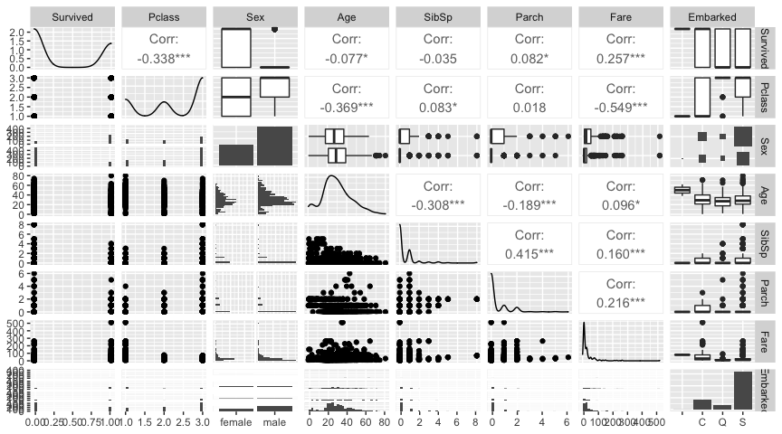
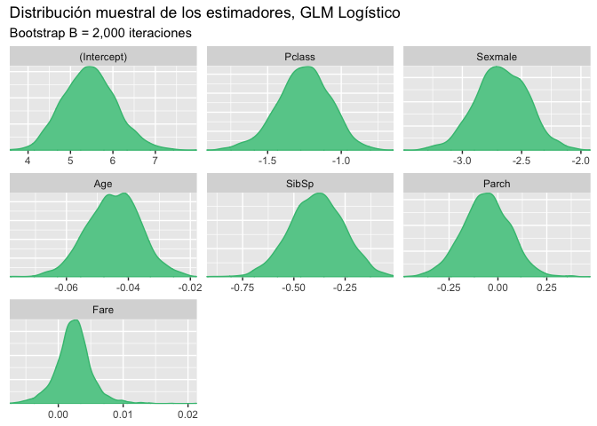
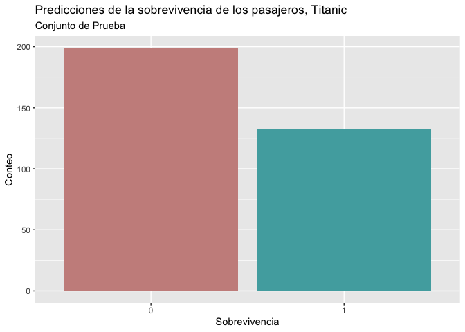

Sobrevivencia en el Titanic
================
Asael Alonzo Matamoros
2022-11-22

El nombre del barco “Titanic” se inspira de los titanes de la mitología
Griega, y pese que fue de los cruceros más grandes de su época, se
hundió en su primera excursión, ocasionando la muerte de miles de sus
tripulantes. Se desea crear un modelo que prediga el número de
sobrevivientes en la excursión, para eso utilizaremos los registros de
muerte del evento, la base de datos se divide en dos conjuntos

- `Train`: que contiene 891 registros, usado para entrenar los modelos
  de clasificación.

- `Test`: contiene 418 registros, para corroborar las predicciones del
  modelo, pero la variable de interés no se encuentra en el conjunto de
  datos.

``` r
library(caret)
library(GGally)
library(ggplot2)
library(flextable)
library(bayesplot)
library(ggfortify)

bayesplot_theme_set(theme_grey())

load("Titanic.RData")
```

La base de datos `Train` contiene las siguiente variables:

- `survival`: Indica si la sobrevivencia del pasajero. (**Dependiente**)

- `pclass`: La clase de abordaje en el boleto. (`1 = "1st"`, `2 = '2nd"`
  y `3 = "3rd"`)

- `sex`: Género de los pasajeros.

- `Age`: Edad en años.

- `sibsp`: número de parientes/esposas a bordo.

- `parh`: número de padres/hijos a bordo.

- `ticket`: número del boleto.

- `fare`: precio del boleto.

- `cabin`: número de cabina.

- `embarked`: Puerto de embarcación. `C = Chersbourg`, `Q = Queenstown`,
  y `S = Southampton`.

## Verosimilitud

La variable `survival` es una variable indicadora que representa si el
pasajero abordo sobrevivió el hundimiento del Titanic. Dado que es una
v.a. discreta y dicotómica se puede modelar con una distribución de
Bernoulli.

, \quad y_i = 0,1. \quad \& \quad f(y) = p^y(1-p)^{(1-y)}.")

Donde  representa la
probabilidad de éxito (`éxito := 1`), que indica que el paciente
sobrevivió.

Para este tipo de modelos se utilizan GLMs Logísticos, cuya estructura
se presenta en la siguiente ecuación:

,\quad g(p) = \text{logit}(p_i), \text{ y } p_i = \frac{1}{1 + e^{-\beta X_i}}.")

Donde:

- ,
  es la función logit
   = \log\left(\frac{p}{1-p}\right)").

-  = \frac{1}{1 + e^{-x}}")
  es la función logística.

-  son las covariables.

Finalmente, realizamos un gráfico de correlaciones para identificar las
interacciones lineales entre variables.

``` r
ggpairs(Train[,-1])
```

<figure>

<figcaption aria-hidden="true">Figure 1: Gráfico de pares. La diagonal
principal muestra histogramas densidades de cada una de las variables.
La parte superior muestra el coeficiente de correlación entre dos
variables, fila y columna. La parte inferior muestra un gráfico de
dispersión entre dos variables.</figcaption>
</figure>

La [Figure 1](#fig-pairs) es poco informativa debido que múltiples
variables, incluida la de interés, son variables discretas. Una forma
alternativa de medir la dispersión en v.a.d. es usar gráficos de barras
compuestos o gráfico de bombones. Para medir correlación un indicador no
paramétrico equivalente, es el coeficiente de
[Kendall](https://en.wikipedia.org/wiki/Kendall_rank_correlation_coefficient).

## Ajuste del GLM Logístico

Ajustamos el modelo GLM logístico completo que consiste en usar todas
las variables, y revisamos el ajuste e inferencia de los parámetros.

``` r
m1  = glm(Survived ~ Pclass + Sex + Age + SibSp + Parch + Fare,
            data = Train, family = "binomial")

summary(m1)
```


    Call:
    glm(formula = Survived ~ Pclass + Sex + Age + SibSp + Parch + 
        Fare, family = "binomial", data = Train)

    Deviance Residuals: 
        Min       1Q   Median       3Q      Max  
    -2.7953  -0.6476  -0.3847   0.6271   2.4433  

    Coefficients:
                 Estimate Std. Error z value Pr(>|z|)    
    (Intercept)  5.389003   0.603734   8.926  < 2e-16 ***
    Pclass      -1.242249   0.163191  -7.612 2.69e-14 ***
    Sexmale     -2.634845   0.219609 -11.998  < 2e-16 ***
    Age         -0.043953   0.008179  -5.374 7.70e-08 ***
    SibSp       -0.375755   0.127361  -2.950  0.00317 ** 
    Parch       -0.061937   0.122925  -0.504  0.61436    
    Fare         0.002160   0.002493   0.866  0.38627    
    ---
    Signif. codes:  0 '***' 0.001 '**' 0.01 '*' 0.05 '.' 0.1 ' ' 1

    (Dispersion parameter for binomial family taken to be 1)

        Null deviance: 964.52  on 713  degrees of freedom
    Residual deviance: 635.81  on 707  degrees of freedom
      (177 observations deleted due to missingness)
    AIC: 649.81

    Number of Fisher Scoring iterations: 5

El modelo completo da una impresión con buenos resultados, todas las
variables excepto el precio de boletos (`Fare`) y el número de
Padres/hijos (`parch`) resultaron significativas; pero los residuos no
están centrados en cero, por ende no cumplen los supuestos iniciales.

El siguiente código genera una muestra Bootstrap para los parámetros del
modelo .

``` r
glm_boots = function(dat,B = 1000){
  n = dim(dat)[1]
  est = NULL
  for (i in 1:B) {
    si = sample(x = 1:n,size = n,replace = TRUE)
    dsi = dat[si,]
    mli = glm(Survived ~ Pclass + Sex + Age + SibSp + Parch + Fare,
              data = dsi,family = binomial)
    ci = as.array(mli$coefficients)
    est = rbind(est,ci)
  }
  # Estética
  return(est)
}
```

Obtenemos una muestra Bootstrap para los estimadores

de tamaño

repeticiones.

``` r
btp = glm_boots(dat = Train,B = 2000)

color_scheme_set("green")
mcmc_dens(btp)+labs(title="Distribución muestral de los estimadores, GLM Logístico",
                    subtitle ="Bootstrap B = 2,000 iteraciones")
```

<figure>

<figcaption aria-hidden="true">Figure 2: Gráfico de densidades. Cada
densidad representa la distribución muestral aproximada para cada uno de
los estimadores usando un Bootstrap de B = 2,000
iteraciones.</figcaption>
</figure>

Los intervalos de confianza al 95% son:

``` r
x = apply(btp,MARGIN = 2, FUN = quantile, probs = c(0.025,0.5,0.975)) 

# Estética
x = data.frame( t(x) )
x$pars = c("intercepto","Pclass","Sexmal","Age","SibSp","Parch","Fare")
colnames(x) = c("q2.5%","Median","q97.5%","parámetros")

ft = flextable(x[c(4,1,2,3)])
autofit(ft)
```

La [Figure 2](#fig-btp1) muestra la distribución muestral de los
estimadores del modelo, y la **?@tbl-btp1** muestra los intervalos de
confianza.El efecto de las variables `Fare` y `Parxh` está concentrado
en cero, por lo tanto, se deberá considerar un GLM logístico reducido.

Los residuos no son una medida correcta para evaluar el ajuste del
modelo. Esto se debe a que el modelo predice de forma continua valores
en el intervalo unitario
![I = \[0,1\]](https://latex.codecogs.com/svg.latex?I%20%3D%20%5B0%2C1%5D "I = [0,1]")
y los datos son los enteros en la clausura de
. Una forma adecuada de
visualizar los residuos es usando la matriz de confusión, esta es una
matriz en

que presenta el ajuste del modelo.


Donde:

-  representa los
  valores predichos correctamente como positivos (1).

-  representa los
  valores predichos correctamente como negativos (0).

-  representan los
  valores falsos positivos,
  
  cuando
  .

-  representan los
  valores falsos negativos,
  
  cuando
  .

``` r
pred1 = predict(m1,Train[,-c(1:2)],type = "response")
pred1 =  ifelse(pred1 > 0.5, 1, 0)
   
x = table(pred1, Train$Survived)
x = round(prop.table(x)*100,2)
x
```

         
    pred1     0     1
        0 50.98 11.20
        1  8.40 29.41

Una medida importante es la precisión (*“Accuracy”*) del modelo, que es
el porcentaje de aciertos del modelo. Que se calcula como la suma de las
diagonales en la matriz de confusión. El accuracy para el modelo
 es:

``` r
Accuracy = sum(diag(x))
Accuracy
```

    [1] 80.39

## Selección de modelos, 10-fold-CV

Para seleccionar el mejor modelo usaremos validación cruzada, 10-fold,
esto implica que ajustaremos diez veces cada modelo, evaluando la
precisión del modelo. Los modelos que se consideraran son los
siguientes:

-  Modelo de
  logístico completo

-  Modelo
  logístico reducido sin la variable `Parch`.

-  Modelo
  logístico reducido sin variables `Parch` y `Fare`.

El siguiente código presenta una función para realizar **k-fold-CV**
para cualquier valor de
. En caso de querer
añadir otros modelos o criterios, la función deberá ser modificada.

``` r
kfold = function(df,k){
  # Generar la particion
  kfld = createFolds(df[,1],k = k)
  mat = NULL
  
  for (i in 1:k) {
    # separar los datos en conjuntos de prueba y entrenamiento
    dfE= df[-kfld[[i]],]
    dfP = df[kfld[[i]],]
    # Ajustar los modelos
    m1  = glm(Survived ~ Pclass + Sex + Age + SibSp + Parch + Fare,
              data = dfE,family = binomial)
    m2 = glm(Survived ~ Pclass + Sex + Age + SibSp + Fare,
              data = dfE,family = binomial)
    m3  = glm(Survived ~ Pclass + Sex + Age + SibSp,
              data = dfE,family = binomial)

    
    p1  = predict(m1,dfP,type = "response")
    p1 =  ifelse(p1 > 0.5, 1, 0)
    p2 = predict(m2,dfP,type = "response")
    p2 =  ifelse(p2 > 0.5, 1, 0)
    p3  = predict(m3,dfP,type = "response")
    p3 =  ifelse(p3 > 0.5, 1, 0)

    Accuracy = c(
      sum(diag(round(prop.table(table(p1, dfP[,2]))*100,2))),
      sum(diag(round(prop.table(table(p2, dfP[,2]))*100,2))),
      sum(diag(round(prop.table(table(p3, dfP[,2]))*100,2)))
    )

    # Unir los datos
    mat = rbind(mat,Accuracy) 
  }
  colnames(mat) = c("Accuracy1","Accuracy2","Accuracy3")
  row.names(mat) = NULL
  return(mat)
}
```

**?@tbl-cv** presenta los resultados obtenidos al realizar 10-fold-cv,
el modelo  es el
que presenta la mejor precisión de los tres modelos evaluados.

``` r
rst = kfold(df = na.exclude(Train),k = 10)
x = t(apply(rst,MARGIN = 2,FUN = "quantile",probs = c(0.025,0.5,0.975)))

# Estética
x = data.frame(x)
x$pars =  c("Accuracy1", "Accuracy2", "Accuracy3")
colnames(x) = c("q2.5%","Median","q97.5%","Criterio")

ft = flextable(x[c(4,1,2,3)])
autofit(ft)
```

**?@tbl-cv** compara los tres modelos, usando la medida de precisión, y
el modelo reducido
 tiene resultados
ligeramente mejores. Finalmente, se predice en el conjunto de prueba, la
[Figure 3](#fig-pred) presenta las predicciones realizadas por el modelo
 para 332
pasajeros, donde la mayoría de ellos no sobreviven al hundimiento del
barco.

``` r
m3 = glm(Survived ~ Pclass + Sex + Age + SibSp,
              data = Train,family = binomial)

p3  = predict(m3,Test,type = "response")
p3 =  ifelse(na.exclude(p3) > 0.5, 1, 0)
p3 = data.frame(p3)

ggplot(p3, aes(x=as.factor(p3), fill=as.factor(p3) )) + 
  geom_bar( ) + scale_fill_hue(c = 40) +
  labs(title = "Predicciones de la sobrevivencia de los pasajeros, Titanic",
       subtitle = "Conjunto de Prueba",
       x = "Sobrevivencia",y = "Conteo")+theme(legend.position="none")
```

<figure>

<figcaption aria-hidden="true">Figure 3: Gráfico de predicciones. La
barra roja presenta el número de pasajeros que no sobrevivieron al
hundimiento del Titanic.</figcaption>
</figure>

## Referencias

<div id="refs" class="references csl-bib-body hanging-indent">

<div id="ref-Casella" class="csl-entry">

Casella, George, and Roger Berger. 2001. *Statistical Inference*.
Duxbury Resource Center.
<http://www.amazon.fr/exec/obidos/ASIN/0534243126/citeulike04-21>.

</div>

<div id="ref-degroot2012" class="csl-entry">

DeGroot, M. H., and M. J. Schervish. 2012. *Probability and Statistics*.
Addison-Wesley. <https://books.google.es/books?id=4TlEPgAACAAJ>.

</div>

<div id="ref-gelman2013" class="csl-entry">

Gelman, A., J. B. Carlin, H. S. Stern, D. B. Dunson, A. Vehtari, and D.
B. Rubin. 2013. *Bayesian Data Analysis, Third Edition*. Chapman &
Hall/CRC Texts in Statistical Science. Taylor & Francis.
<https://books.google.nl/books?id=ZXL6AQAAQBAJ>.

</div>

<div id="ref-BMCP2021" class="csl-entry">

Martin, Osvaldo A., Ravin Kumar, and Junpeng Lao. 2021. *<span
class="nocase">Bayesian Modeling and Computation in Python</span>*. Boca
Raton.

</div>

<div id="ref-Miggon2014" class="csl-entry">

Migon, Helio, Dani Gamerman, and Francisco Louzada. 2014. *Statistical
Inference. An Integrated Approach*. Chapman and Hall CRC Texts in
Statistical Science. Chapman; Hall.

</div>

<div id="ref-BMLR2021" class="csl-entry">

Roback, paul., and Julie. Legler. 2021. *<span class="nocase">Beyond
Multiple Linear Regression: Applied Generalized Linear Models an
Multilevel Models in R</span>*. Boca Raton.

</div>

</div>
