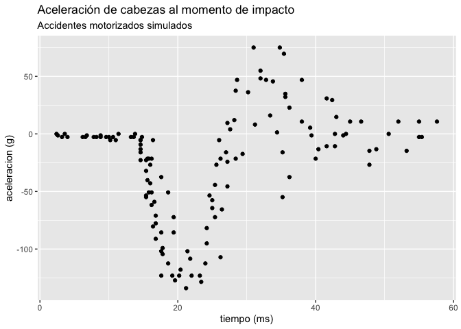
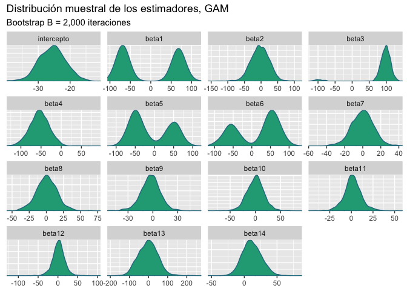
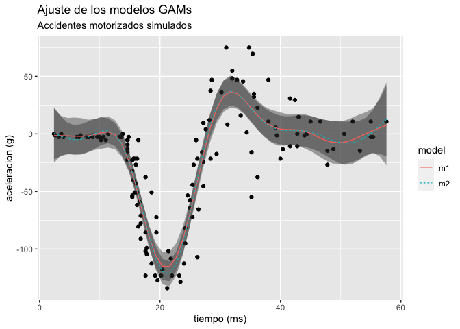
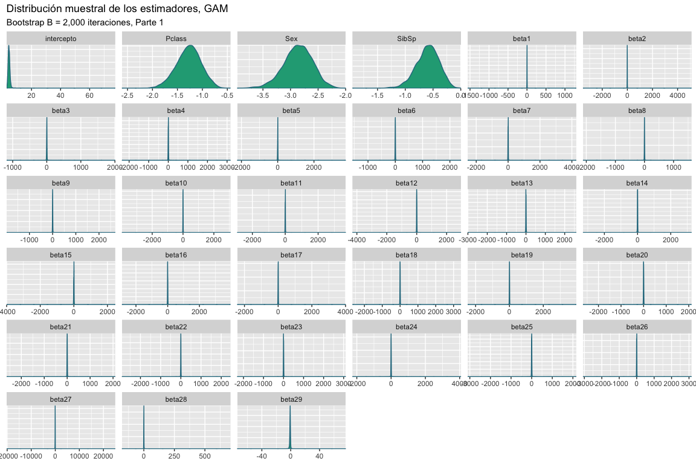

Introducción a modelos no lineales
================
Asael Alonzo Matamoros
2022-11-24

Los modelos aditivos generalizados (GAMs) relacionan forma no lineal al
conjunto de v.a. independientes
,
tal que
 \in \mathbb R^{d+1}").
La colección  sigue un
GAM si:

, \quad \text{y } g(\theta_i) = \sum_{s = 1}^mf_s(X_i),")

Donde:

- 
  representa la familia exponencial.

- El conjunto
  
  representa una colección de parámetros de locación.

- 
  es una función diferenciable e invertible, conocida como la **función
  de enlace**.

- 
  es el vector de coeficientes de regresión o importancias.

- las funciones
  
  son suaves y diferenciables, de tal forma que, se pueden aproximar
  mediante la siguiente expresión:

 \approx \sum^K_{k = 1}\beta_{k,s} b_{k,s}(X),")

- donde
  
  son los coeficientes por estimar y
  ")
  son una base de funciones *“conocidaS.”*

Dado que  

![B_s(X) = \[b\_{1,s}(X),b\_{2,s}(X),\ldots,b\_{K,s}(X)\],](https://latex.codecogs.com/svg.latex?B_s%28X%29%20%3D%20%5Bb_%7B1%2Cs%7D%28X%29%2Cb_%7B2%2Cs%7D%28X%29%2C%5Cldots%2Cb_%7BK%2Cs%7D%28X%29%5D%2C "B_s(X) = [b_{1,s}(X),b_{2,s}(X),\ldots,b_{K,s}(X)],")

es una base, entonces los
")
son una colección linealmente independiente en un espacio de funciones
(). Este resultado
implica que estimar la función no lineal
") es
equivalente a resolver el problema de **regresión lineal:**

 = B_s(X) \hat \beta.")

Este tipo de modelos tiene dos limitantes, el primero es seleccionar una
base adecuada, y segundo elegir el número de óptimo de elementos en la
base . Si
 es muy grande el modelo
sobre-ajusta los datos (*overfitting*). Una solución es penalizar el
suavizado con:

 = \int \partial^2f^2(x) dx.")

Por lo tanto, el problema de optimización se escribe como:

 - f_s(X)||^2 + \lambda P(f),")

 - B_s(X)\beta ||^2 + \lambda \beta^tS\beta.")

Donde
B_s(X) dx"),
es la penalización. Note que el problema de optimización anterior es
equivalente a resolver un problema de regresión lineal penalizado, que a
su vez puede ser re-escrito como un problema de regresión lineal
completo.

## Ejemplo: mcycle dataset

``` r
library(mgcv)
library(caret)
library(tidymv)
library(GGally)
library(ggplot2)
library(flextable)
library(bayesplot)

bayesplot_theme_set(theme_grey())
data("mcycle",package = "MASS")
load("Titanic.RData")
```

La base de datos `mcycles` presenta una serie de mediciones de la
aceleración de cabezas en un accidente motorizado simulado para probar
la resistencia al impacto en cascos. La base de datos contiene las
siguiente variables:

- `accel`: La aceleración obtenida al momento de impacto.
  (**Dependiente**)

- `times`: El tiempo previo al impacto. (`ms`)

``` r
ggplot(mcycle,aes(times, accel))+
  geom_point()+
  labs(title = "Aceleración de cabezas al momento de impacto",
       subtitle = "Accidentes motorizados simulados",
       y = "aceleracion (g)",x  = "tiempo (ms)")
```

<figure>

<figcaption aria-hidden="true">Figure 1: Gráfico de dispersión de las
simulaciones.</figcaption>
</figure>

Para medir la relación de la aceleración obtenida de los accidentes
utilizaremos un GAM normal tal que:

, \quad  g(\mu_i) = \mu_i, \text{ y } \mu_i = f(times_i).")

Donde
 = \sum^k_{t = 1}\beta_t b_t(times)")
representa aproximación por base Splines para la media del modelo. El
siguiente código limpia la base de datos para obtener las variables de
interés

``` r
m1 = gam(accel ~ s(times,k = 15,bs = "fs",m = 2),data = mcycle)
summary(m1)
```


    Family: gaussian 
    Link function: identity 

    Formula:
    accel ~ s(times, k = 15, bs = "fs", m = 2)

    Parametric coefficients:
                Estimate Std. Error t value Pr(>|t|)    
    (Intercept)  -25.546      1.965     -13   <2e-16 ***
    ---
    Signif. codes:  0 '***' 0.001 '**' 0.01 '*' 0.05 '.' 0.1 ' ' 1

    Approximate significance of smooth terms:
               edf Ref.df     F p-value    
    s(times) 10.44  12.18 38.07  <2e-16 ***
    ---
    Signif. codes:  0 '***' 0.001 '**' 0.01 '*' 0.05 '.' 0.1 ' ' 1

    R-sq.(adj) =   0.78   Deviance explained = 79.8%
    GCV = 561.61  Scale est. = 513.3     n = 133

El resumen del modelo presenta un análisis de significancia para el
vector de parámetros
,
que en este caso es de dimensión
, y
que debido al TLC se distribuye normal multivariada. El siguiente código
genera una muestra Bootstrap para cada uno de los parámetros del modelo
.

``` r
gam_boots = function(dat,B = 2000){
  n = dim(dat)[1]
  est = NULL
  for (i in 1:B) {
    si = sample(x = 1:n,size = n,replace = TRUE)
    mli = gam(accel[si] ~ s(times[si],k = 15,bs = "fs",m = 2),data = dat)
    ci = as.array(mli$coefficients)
    est = rbind(est,ci)
  }
    # Estética
  cn = dim(est)[2]-1
  colnames(est) = c("intercepto",paste0("beta",1:cn))
  return(est)
}
```

Obtenemos una muestra Bootstrap para los estimadores

de tamaño

repeticiones.

``` r
btp = gam_boots(dat = mcycle,B = 2000)

color_scheme_set("viridis")

mcmc_dens(btp)+
  labs(title = "Distribución muestral de los estimadores, GAM",
       subtitle ="Bootstrap B = 2,000 iteraciones")
```

<figure>

<figcaption aria-hidden="true">Figure 2: Gráfico de densidades. Cada
densidad representa la distribución muestral aproximada para cada uno de
los estimadores usando un Bootstrap de B = 2,000
iteraciones.</figcaption>
</figure>

Los intervalos de confianza al 95% son:

``` r
x = apply(btp,MARGIN = 2, FUN = quantile, probs = c(0.025,0.5,0.975)) 

# Estética
x = data.frame( t(x) )
x$pars = c("intercepto",paste0("beta",1:14))
colnames(x) = c("q2.5%","Median","q97.5%","parámetros")

ft = flextable(x[c(4,1,2,3)])
autofit(ft)
```

Los intervalos de confianza revelan mayor información a lo obtenido por
la prueba-t, el análisis de incertidumbre revela que parámetros desde
`beta7` hasta `beta14` son no significativos, y otros parámetros como
`beta1` sus intervalos de confianza son no significativos pero sus
densidades muestran que cero no contiene probabilidad.

Este análisis revela que el número de nodos en la base es muy grande,
por lo tanto, se deberá probar con un modelo más pequeño. Analizamos los
residuos del modelo, el siguiente código muestra están centrados en cero
pero con alta dispersión.

``` r
summary(m1$residuals)
```

        Min.  1st Qu.   Median     Mean  3rd Qu.     Max. 
    -76.8753 -12.3859  -0.6566   0.0000  12.5556  50.5333 

Finalmente, ajustamos un modelo más pequeño, el modelo
 es un modelo con
base splines tal que el numero de nodos se estimo con validación cruzada
generalizada (GCV), resultando con

nodos.

``` r
m2 = gam(accel ~ s(times),data = mcycle)

pred1 = predict_gam(m1)
pred2 = predict_gam(m2)

pred = rbind(pred1,pred2)
pred$model = sort(rep(c("m1","m2"),50))

ggplot(pred,aes(times, fit))+
  geom_point(data = mcycle,aes(x = times,y = accel))+
  geom_smooth_ci(group = model,ci_alpha = 0.4)+
  labs(title = "Ajuste de los modelos GAMs",
       subtitle = "Accidentes motorizados simulados",
       y = "aceleracion (g)",x  = "tiempo (ms)")
```

<figure>

<figcaption aria-hidden="true">Figure 3: Gráfico de ajuste. Se muestra
el ajuste de ambos modelos, estos estiman una curva suave para ambos
datos, con la limitante de que los intervalos predictivos no se ajustan
a los valores atípicos.</figcaption>
</figure>

Dado que en este modelo queremos encontrar el mejor ajuste, usar un
criterio de información como el AIC es suficiente y necesario.
**?@tbl-aic** compara ambos modelos donde el modelo
 que contiene
menos nodos presenta un mejor ajuste.

``` r
x = AIC(m1,m2)

# Estética
x = data.frame(x)
x
```

             df      AIC
    m1 12.44132 1220.390
    m2 10.69331 1216.889

``` r
x$modelo = c("M1","M2")
colnames(x) = c("df","AIC","Modelo")

ft = flextable(x[c(3,1,2)])
autofit(ft)
```

## Sobrevivencia en el Titanic

Regresamos al análisis de sobrevivencia del Titanic, la base de datos
contiene 891 registros y 9 variables, en el trabajo anterior se estimo
un modelo GLM logístico para predecir la sobrevivencia de los pasajeros.
El modelo seleccionado descartó variables como `Fare` y `Parch`,
resultando en el modelo:

![M2: survival_i \sim \text{Bernoulli}(p_i), \quad p_i = \frac{1}{1 + e^{-\beta X_i}}; y \quad X_i = \[Pclass, Sex, Age, SibSp\].](https://latex.codecogs.com/svg.latex?M2%3A%20survival_i%20%5Csim%20%5Ctext%7BBernoulli%7D%28p_i%29%2C%20%5Cquad%20p_i%20%3D%20%5Cfrac%7B1%7D%7B1%20%2B%20e%5E%7B-%5Cbeta%20X_i%7D%7D%3B%20y%20%5Cquad%20X_i%20%3D%20%5BPclass%2C%20Sex%2C%20Age%2C%20SibSp%5D. "M2: survival_i \sim \text{Bernoulli}(p_i), \quad p_i = \frac{1}{1 + e^{-\beta X_i}}; y \quad X_i = [Pclass, Sex, Age, SibSp].")

El análisis realizado no contempla relaciones no lineales entre `Fare` y
`survival`. Por lo tanto, re-evaluamos la interacción no lineal con las
variables continuas `Age` y `Fare`. El nuevo modelo es:

, \quad p_i = \frac{1}{1 + e^{f_1(X_i)+f_2(X_k)}}.")

Donde:

-  = \text{logit}(p_i)"),
  es la función de enlace.

-  = f_1(X_i) + f_2(X_k)").
  Las covariables interactuan de forma aditiva.

- ![f_1(X_i) = \beta_1\*\[Pclass, Sex, SibSp\]](https://latex.codecogs.com/svg.latex?f_1%28X_i%29%20%3D%20%5Cbeta_1%2A%5BPclass%2C%20Sex%2C%20SibSp%5D "f_1(X_i) = \beta_1*[Pclass, Sex, SibSp]"),
  es un funcional lineal.

-  = f(Age,Fare) \approx \sum_{k=1}^K \beta_2 b(Age, Fare)"),
  es un funcional no lineal.

## Ajuste del GAM Logístico

Ajustamos el modelo GAM logístico propuesto,y revisamos el ajuste e
inferencia de los parámetros.

``` r
m3  = gam(Survived ~ Pclass + Sex + SibSp + s(Fare,Age),
            data = Train, family = "binomial")
summary(m3)
```


    Family: binomial 
    Link function: logit 

    Formula:
    Survived ~ Pclass + Sex + SibSp + s(Fare, Age)

    Parametric coefficients:
                Estimate Std. Error z value Pr(>|z|)    
    (Intercept)   4.1641     0.5141   8.099 5.53e-16 ***
    Pclass       -1.2076     0.2123  -5.689 1.28e-08 ***
    Sexmale      -2.6842     0.2261 -11.869  < 2e-16 ***
    SibSp        -0.5303     0.1605  -3.305 0.000951 ***
    ---
    Signif. codes:  0 '***' 0.001 '**' 0.01 '*' 0.05 '.' 0.1 ' ' 1

    Approximate significance of smooth terms:
                  edf Ref.df Chi.sq p-value   
    s(Fare,Age) 16.65  21.44  46.34 0.00103 **
    ---
    Signif. codes:  0 '***' 0.001 '**' 0.01 '*' 0.05 '.' 0.1 ' ' 1

    R-sq.(adj) =  0.437   Deviance explained = 37.7%
    UBRE = -0.10016  Scale est. = 1         n = 714

El modelo parece ser adecuado, todos los parámetros son significativos y
la interaccion no lineal parece brindar buenos resultados. El siguiente
código genera una muestra Bootstrap para cada uno de los parámetros del
modelo .

``` r
gam_boots = function(dat,B = 2000){
  n = dim(dat)[1]
  est = NULL
  for (i in 1:B) {
    si = sample(x = 1:n,size = n,replace = TRUE)
    mli = gam(Survived[si] ~ Pclass[si] + Sex[si] + SibSp[si] + s(Fare[si],Age[si]),
            data = dat, family = "binomial")
    ci = as.array(mli$coefficients)
    est = rbind(est,ci)
  }
    # Estética
  cn = dim(est)[2]-4
  colnames(est) = c("intercepto","Pclass","Sex","SibSp",paste0("beta",1:cn))
  return(est)
}
```

Obtenemos una muestra Bootstrap para los estimadores

de tamaño

repeticiones.

``` r
btp = gam_boots(dat = na.exclude(Train),B = 5000)

color_scheme_set("viridis")

mcmc_dens(btp)+
  labs(title = "Distribución muestral de los estimadores, GAM",
       subtitle ="Bootstrap B = 2,000 iteraciones")
```

<figure>

<figcaption aria-hidden="true">Figure 4: Gráfico de densidades. Cada
densidad representa la distribución muestral aproximada para cada uno de
los estimadores usando un Bootstrap de B = 2,000
iteraciones.</figcaption>
</figure>

La [Figure 2](#fig-btp1) muestra la distribución muestral de los
estimadores del modelo, se observa que los efectos de la componente no
lineal son muy dispersos y centrados en cero. Existe la posibilidad que
el efecto no lineal sea no significativo.

Para evaluar el ajuste del modelo calculamos la matriz de confusión y la
precisión del modelo.

``` r
pred1 = predict (m3,Train[,-c(1:2)],type = "response")
pred1 =  ifelse(pred1 > 0.5, 1, 0)
   
x = table(pred1, Train$Survived)
x = round(prop.table(x)*100,2)
x
```

         
    pred1     0     1
        0 51.26 10.50
        1  8.12 30.11

La precisión para el modelo
 es:

``` r
Accuracy = sum(diag(x))
Accuracy
```

    [1] 81.37

## Selección de modelos, 10-fold-CV

Para seleccionar el mejor modelo usaremos validación cruzada, 10-fold,
esto implica que ajustaremos diez veces cada modelo, evaluando la
precisión del modelo. Los modelos que se consideraran son los
siguientes:

-  GLM
  logístico reducido sin variables `Parch` y `Fare`.

-  GAM logístico
  con variables lineales `Pclass`, `Sex`, y `SibSp`. Componente no
  lineal `Age` y `Fare`

El siguiente código presenta una función para realizar **k-fold-CV**
para cualquier valor de
. En caso de querer
añadir otros modelos o criterios, la función deberá ser modificada.

``` r
kfold = function(df,k){
  # Generar la particion
  kfld = createFolds(df[,1],k = k)
  mat = NULL
  
  for (i in 1:k) {
    # separar los datos en conjuntos de prueba y entrenamiento
    dfE= df[-kfld[[i]],]
    dfP = df[kfld[[i]],]
    # Ajustar los modelos
    m2  = glm(Survived ~ Pclass + Sex + Age + SibSp,
              data = dfE,family = binomial)
    m3  = gam(Survived ~ Pclass + Sex + SibSp + s(Fare,Age),
            data = dfE, family = "binomial")

    p2 = predict(m2,dfP,type = "response")
    p2 =  ifelse(p2 > 0.5, 1, 0)
    p3  = predict(m3,dfP,type = "response")
    p3 =  ifelse(p3 > 0.5, 1, 0)

    Accuracy = c(
      sum(diag(round(prop.table(table(p2, dfP[,2]))*100,2))),
      sum(diag(round(prop.table(table(p3, dfP[,2]))*100,2)))
    )

    # Unir los datos
    mat = rbind(mat,Accuracy) 
  }
  colnames(mat) = c("Accuracy1","Accuracy2")
  row.names(mat) = NULL
  return(mat)
}
```

**?@tbl-cv** presenta los resultados obtenidos al realizar 10-fold-cv,
el modelo  es el
que presenta la mejor precisión de los dos modelos evaluados.

``` r
rst = kfold(df = na.exclude(Train),k = 10)
x = t(apply(rst,MARGIN = 2,FUN = "quantile",probs = c(0.025,0.5,0.975)))

# Estética
x = data.frame(x)
x$pars =  c("Accuracy2", "Accuracy3")
colnames(x) = c("q2.5%","Median","q97.5%","Criterio")

ft = flextable(x[c(4,1,2,3)])
autofit(ft)
```

## Referencias

<div id="refs" class="references csl-bib-body hanging-indent">

<div id="ref-Casella" class="csl-entry">

Casella, George, and Roger Berger. 2001. *Statistical Inference*.
Duxbury Resource Center.
<http://www.amazon.fr/exec/obidos/ASIN/0534243126/citeulike04-21>.

</div>

<div id="ref-degroot2012" class="csl-entry">

DeGroot, M. H., and M. J. Schervish. 2012. *Probability and Statistics*.
Addison-Wesley. <https://books.google.es/books?id=4TlEPgAACAAJ>.

</div>

<div id="ref-gelman2013" class="csl-entry">

Gelman, A., J. B. Carlin, H. S. Stern, D. B. Dunson, A. Vehtari, and D.
B. Rubin. 2013. *Bayesian Data Analysis, Third Edition*. Chapman &
Hall/CRC Texts in Statistical Science. Taylor & Francis.
<https://books.google.nl/books?id=ZXL6AQAAQBAJ>.

</div>

<div id="ref-BMCP2021" class="csl-entry">

Martin, Osvaldo A., Ravin Kumar, and Junpeng Lao. 2021. *<span
class="nocase">Bayesian Modeling and Computation in Python</span>*. Boca
Raton.

</div>

<div id="ref-Miggon2014" class="csl-entry">

Migon, Helio, Dani Gamerman, and Francisco Louzada. 2014. *Statistical
Inference. An Integrated Approach*. Chapman and Hall CRC Texts in
Statistical Science. Chapman; Hall.

</div>

<div id="ref-BMLR2021" class="csl-entry">

Roback, paul., and Julie. Legler. 2021. *<span class="nocase">Beyond
Multiple Linear Regression: Applied Generalized Linear Models an
Multilevel Models in R</span>*. Boca Raton.

</div>

</div>
